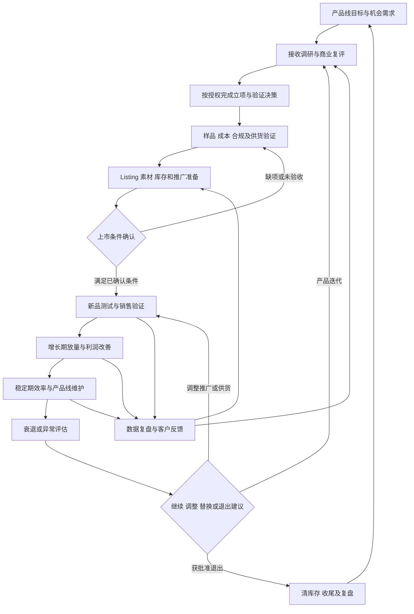

# 亚马逊运营管理流程框架

导航：[公司管理总入口与使用说明](../README.md) · [工作流程索引](00-工作流程索引.md)。

**关系定位：**本流程连接 [运营管理职责说明书](../02-管理角色/02-运营管理/01-职责说明书.md) 的工作。职责边界查看对应说明书，具体步骤在本流程维护；这次负责人、预算和验收结果进入[决策事项记录](../04-经营决策与执行/00-决策事项索引.md)。

状态：框架草案；版本：0.1；建立日期：2026-10-04；正式生效日期待确认。本轮按用户提供的[高级亚马逊运营管理与工作框架原稿](../05-资料与工作成果/01-原始资料/06-亚马逊运营管理框架原稿-20261004.txt)建立结构，后续逐项补充操作步骤、注意点和真实案例。原稿中的工具、功能、认证和指标作为待核对候选项；本轮未核实其当前站点可用性、适用规则或费用。

岗位职责见[运营管理职责说明书](../02-管理角色/02-运营管理/01-职责说明书.md)，指标公式统一引用[经营指标定义与计算口径](../01-公司经营基础/04-经营指标与计算口径.md)。具体项目的目标、预算、批准、执行和结果放在对应决策记录中。

## 1. 目的、范围与使用方式

围绕产品全生命周期，统筹产品线、内容、流量、供货、价格、风险、利润和团队协作。以利润为核心，兼顾销售增长、流量效率、库存周转和产品线长期发展；店铺及 Listing 安全按公司要求优先处理。

适用于欧洲、美国业务及相关产品运营小组。各项目先指定实际负责人、站点、店铺、SKU、阶段与授权范围。本文件定义工作结构，具体人员与能力查人岗记录，数字角色提供分析、核对和建议。

| 项目 | 框架要求 |
| --- | --- |
| 启动条件 | 新品机会、上市交接、阶段转变、定期计划与复盘，或销售、利润、库存及账户异常 |
| 必要输入 | 产品与市场资料、销售及广告数据、成本、库存与交期、客户反馈、人员负荷及已确认授权；来源、日期和缺项明确 |
| 推进职责 | 运营主管统筹；实际区域主管、组长及运营承担已分配工作；跨岗部分由对应现实负责人核对 |
| 核心交付 | 产品经营方案、上市及推广安排、改善任务、阶段评估、风险记录与经营汇报 |
| 完成条件 | 交付经接收方确认可用，遗留问题有责任人，动作与经营结果分别验收，结果未成熟则待观察 |
| 记录位置 | ERP／现有工作表保存数据与操作；项目或决策记录保存版本、批准及复盘；原始依据在资料目录引用 |

使用时先确定生命周期阶段，再选择八个模块中的相关流程；同一项目沿用记录。后续细化优先补输入、动作、验收和异常，不直接把所有候选工具设为必用工具。

## 2. 产品全生命周期总流程

广告、内容、定价和库存协同贯穿经营阶段；账号及产品合规检查贯穿全过程。阶段转变依据经营证据，不只依据上架时长。停止一项广告或降价试验、停止放量、退出整个产品分别判断与记录。

## 3. 八大职能模块与子流程

以下子流程先确定范围、顺序和交付，具体操作与注意点后续细化。表内交付可以是同一项目记录的不同栏目，不要求每项都新建文件。

### 3.1 产品线规划与选品协同

主流程：**产品线目标 → 接收开发资料 → 商业复评 → 差异化及 SKU 规划 → 利润与风险验证 → 提交决策 → 上市承接 → 生命周期管理。**

| 编号／子流程 | 要开展的工作 | 交付与协作 |
| --- | --- | --- |
| 1.1 开发结果复评 | 核对市场容量、BSR、竞争、价格带、评论痛点、季节性、趋势及推广难度；区分平台数据、工具估算与假设 | 商业复评结论、缺项及反对证据；与产品开发共同核对 |
| 1.2 利润模型 | 测算采购、佣金、FBA、头程、广告、仓储、退货、促销及其他相关成本；比较售价、订单量、推广投入和回本路径 | 分阶段利润及投入情景；财务核口径，仓库补物流和包装数据 |
| 1.3 机会与风险 | 核对知识产权、类目准入、适用认证、危险品、电池、欧代及包装标签等适用项 | 风险清单、证据与未决项；专业合规事项由适用负责人复核 |
| 1.4 差异化与 SKU／变体 | 将消费者可感知的差异转为购买理由，确定候选款式、规格、变体及上市顺序 | 产品定位、SKU 规划、卖点证据及首批建议；合法变体关系待对应规则核实 |
| 1.5 生命周期与产品矩阵 | 判断新品、增长、稳定、衰退阶段；规划销售主力、利润、引流、防御及补充产品角色 | 产品线矩阵与阶段策略；检查内部替代、关键词及广告竞争 |

立项、首批采购和上市准备详细交接沿用[新品开发与上市交接流程](03-新品开发与上市交接流程.md)。运营形成商业承接意见和首批数量建议，立项及投入按现行授权提交决定。

### 3.2 Listing 体系搭建与转化优化

主流程：**产品事实与竞品资料 → 用户需求及关键词分析 → 定位和内容方案 → 美工制作及审核 → 上线核对 → 转化验证 → 客户反馈与迭代。**

| 编号／子流程 | 要开展的工作 | 交付与协作 |
| --- | --- | --- |
| 2.1 关键词体系 | 汇总可取得的品牌分析、竞品、第三方工具、历史广告及搜索词资料；按品类、场景、受众、功能、材质、规格等分类 | 关键词池、来源、相关性、验证状态和布局建议；搜索词与关键词分别记录 |
| 2.2 AI 辅助需求分析 | 按下方五步分析竞品与用户需求，人工核对输出 | 定位、卖点、用户异议、证据及信息缺口 |
| 2.3 标题与五点 | 将核心词、属性、场景和差异化组织为可读内容，核对规格及承诺 | 分站点标题、五点、后台搜索词草案和审核记录 |
| 2.4 图片、视频与 A+ | 提出视觉逻辑、顺序、每张图片回答的问题、尺寸兼容性及使用说明；与美工确认工时和交付 | 素材需求表、内容结构、已验收素材及上线版本；沿用 04.06 |
| 2.5 转化持续优化 | 观察展示、点击、会话、订单、价格、评价及退货，定位页面或其他因素，设计对照与优化 | 优化假设、修改记录和试验结果；不把单一指标异常直接判成因果 |
| 2.6 评论与客户问题 | 合规评价管理、评论及客户问答监控、差评与退货原因分类，反馈产品、包装、说明书和页面问题 | 客户问题清单、根因、整改责任及效果；Vine 等机制先核资格与规则 |
| 2.7 品牌内容 | 评估品牌店铺、故事、A+、视频等内容及原稿所列其他功能的适用性，组织产品矩阵表达 | 品牌内容计划及素材需求；具体功能按账户、站点和当期开放情况确定 |

**AI 辅助分析保留原稿的五阶段：**

1. **竞品资料采集**：原稿提出 4–5 个成熟竞品及 1–2 个近期新品作为初始样本参考。记录站点、采集日期、上架时间依据、标题、五点、图片、A+、评论、价格与规格；样本按实际竞争范围调整。
2. **第一轮需求提问**：在适用且可访问的 Amazon AI／Rufus 中询问场景、喜爱与不满、替代品和购买理由；保存问题、回复及对应 ASIN。
3. **GPT 综合分析**：结合竞品资料与自有产品事实，形成客群、痛点、顾虑、卖点、差异化和 Listing 方向。
4. **围绕缺口追问与核实**：进一步研究人群差异、价格锚点、异议和视觉缺口；用评论、产品验证及其他原始资料复核 AI 推断。
5. **形成并审核 Listing 方案**：输出定位、标题、五点、关键词、Search Terms、图片与视频方向、A+ 结构、FAQ 及痛点—卖点对应表；人工确认事实、证据、本地化及适用规则后交付。

AI 回复是分析线索；购买动机、不购买原因及需求频率须标注为证据或待验证假设。不得生成产品并不具备的功能、虚构客户问答或评价。搜索、AI 理解与消费者理解是内容检查目标，不能据此承诺排名或转化提升。

### 3.3

主流程：**阶段目标及预算 → 选择广告类型 → 结构与定向 → 测词及竞价 → 放量或收缩 → 增量与利润复盘。**

| 编号／子流程 | 要开展的工作 | 交付与协作 |
| --- | --- | --- |
| 3.1 广告结构 | 根据目标与资格选择商品、品牌、视频、展示等适用广告；DSP 为候选工具；设置自动、匹配方式、ASIN／类目定向等 | 广告结构、命名和目标对应表；按账户与当期产品核可用性 |
| 3.2 生命周期预算 | 根据新品测试、增长放量、稳定维护、衰退阶段配置预算，核对利润及库存承接 | 预算、目标、观察期、累计投入与停止条件；财务核成本 |
| 3.3 关键词与搜索词 | 拓词、测词、筛词、放量、调整竞价及否定，持续更新有效与无效词 | 动态词池及调整记录；调整广告竞价与商品售价分别记录 |
| 3.4 竞价与广告位 | 结合转化、点击成本、利润、广告位和自然表现调整竞价策略 | 调整理由、版本和试验结果 |
| 3.5 流量归因与广告复盘 | 核对搜索词、广告类型、广告位、购买商品等可取得报表，分析总销量、广告归因和自然表现 | 周度复盘草案、增量判断、利润影响及下一步 |

广告订单、自然订单与品牌／搜索标签可能重叠，先核归因窗口和口径；不直接以总订单减广告归因订单断定自然订单。自然占比用于解释流量结构，结合总销量与利润评价广告依赖的变化。

### 3.4 库存、供应链与 FBA 管理

主流程：**销售预测 → 库存与交期核对 → 补货需求 → 物流与成本比较 → 获批采购发运 → FBA 可售跟踪 → 断货、滞销与异常反馈。**

| 编号／子流程 | 要开展的工作 | 交付与协作 |
| --- | --- | --- |
| 4.1 销售预测与补货 | 综合历史、季节、推广、活动及趋势，形成预测区间与安全库存建议 | SKU 预测、补货需求及假设；仓库确认供货，财务核资金 |
| 4.2 库存健康度 | 核对可售、在途、预留、不可售、库龄、周转与仓储成本 | 库存预警、优先级、负责人及处置建议 |
| 4.3 头程与入仓 | 比较适用物流方案的成本和时效，倒排到实际可售时间 | 发运需求及上市／活动可行性；采购质检和发运执行沿用 04.05 |
| 4.4 FBA 异常 | 跟踪入仓延误、数量差异、丢失损坏和费用争议，整理证据及 Case | 异常台账、索赔或核对进度、到账及关闭证据；期限资格另核 |
| 4.5 断货与滞销 | 比较推广收缩、调价、补货、适用促销、移除等方案的利润和现金影响 | 缺货应对或清货方案，批准与执行结果 |

发货、签收与 FBA 可售分别确认。产品、素材或可售节点延期时，更新最早可销售月份，重新估算季节窗口和销售桥，不能仅把原销量机械平移。

### 3.5 价格、促销与排名管理

主流程：**价格及活动目标 → 成本和竞品核对 → 库存与费用测算 → 方案审批 → 活动执行 → 销量、排名与利润评估 → 价格恢复。**

| 编号／子流程 | 要开展的工作 | 交付与协作 |
| --- | --- | --- |
| 5.1 动态价格 | 结合成本、竞争、阶段和库存提出售价、最低价格及例外申请 | 价格方案、利润情景、授权与恢复条件；红线数值待确认 |
| 5.2 促销选择 | 评估原稿所列优惠券、Deal、专享折扣、捆绑和其他适用活动 | 资格及费用核对、促销方案、投入与利润测算 |
| 5.3 排名与份额观察 | 跟踪 BSR、关键词自然表现、广告位置及可取得的市场指标 | 排名与经营变化记录；排名和工具估算不直接等同实际份额 |
| 5.4 大促筹备 | 提前协调库存、物流、素材、价格、活动和预算；原稿 1–2 个月为初始参考 | 活动倒排表、准备状态与复盘；按供货周期及官方活动节点调整 |

排名是观察指标，最终评价结合增量销量、利润、客户体验及库存成本。活动名称、资格、费用、参考价与折扣要求均在具体站点执行前核实。

### 3.6 账号风险、合规与危机处理

主流程：**日常风险检查 → 接收警示或投诉 → 核实事实与影响 → 紧急报告 → 按授权处置与提交证据 → 跟踪恢复 → 预防复核。**

| 编号／子流程 | 要开展的工作 | 交付与协作 |
| --- | --- | --- |
| 6.1 账户健康 | 按履约模式检查适用的订单缺陷、发货、追踪、取消、政策及安全投诉信号 | 风险台账、期限与报告；FBA／FBM适用项分别核对 |
| 6.2 产品与页面合规 | 核对商标专利、产品安全、适用认证、欧代、EPR、包装标签、变体及宣传证据 | 适用性清单与证据、缺口；CE／FCC／WEEE 等不默认全部产品适用 |
| 6.3 危机与申诉 | 处理下架、审核、绩效、安全、知识产权及客户索赔等异常，必要时按要求形成原因、即时纠正与预防措施 | 事实材料、申诉或 POA、处理状态及恢复核对；不能虚构申诉证据 |
| 6.4 账号权限与操作 | 核对合法账户安排、最小必要权限、访问与操作记录、人员交接及数据访问 | 权限与操作规范草案、检查记录；多账户安排按合法业务需要及当期规则审核 |

店铺或 Listing 安全重大异常依现行路径迅速直接口头报告 CEO，详细处置引用[重大经营异常处理流程](09-重大经营异常处理流程.md)。不把有偿换评、刷评或规避平台识别作为增长或安全管理办法。

### 3.7 数据复盘、利润与目标管理

主流程：**核对口径与基线 → 拆解目标 → 监测偏差 → 原因分析 → 改善任务 → 核对实际结果 → 更新计划。**

| 编号／子流程 | 要开展的工作 | 交付与协作 |
| --- | --- | --- |
| 7.1 指标与数据 | 销售、订单、会话、转化；广告花费、CPC、CTR、ACOS、TACOS；评价、退货、退款；库存；利润等分别核来源与口径 | 指标清单、数据缺口及可靠性说明；定义沿用 05.01 |
| 7.2 目标与销售桥 | 按店铺、站点、SKU、月份拆目标，区分老品变化、新品、夏季与新组 | 欧洲、美国两线计划及公司去重桥；新组和夏季作为标签不能重复相加，跨店转移扣除 |
| 7.3 周报、月报与利润 | 按目标、实际、差异、原因、利润影响、行动、责任和时间复盘 | 两线事实与风险、公司综合结论、待决定事项；财务复核利润与现金 |
| 7.4 持续竞品监测 | 跟踪新品、价格、评价、活动、排名、页面和品牌变化 | 竞争动态及影响判断，关联到产品、内容、广告和价格行动 |

详细计划与绩效流程沿用[运营计划与绩效复盘流程](02-运营计划与绩效复盘流程.md)，利润核算沿用[月度利润核算与异常反馈流程](07-月度利润核算与异常反馈流程.md)。内部毛利、贡献利润和公司净利润按各自口径使用；未有独立来源时，不直接填自然转化率或实际市场份额。

### 3.8 跨部门协同与运营体系建设

主流程：**明确需求 → 指定任务与资源 → 上下游确认接收 → 执行及审核 → 异常协调 → 验收 → 培训与经验沉淀。**

| 编号／子流程 | 要开展的工作 | 交付与协作 |
| --- | --- | --- |
| 8.1 产品及供应协同 | 将差评、退货、客服与使用问题转为可验证改进需求，由开发及现有采购接口对接供应方 | 问题证据、改进需求、责任及复测结果 |
| 8.2 美工及内容协同 | 明确图片目标、用户痛点、卖点证据、顺序和每图应回答的问题 | 素材需求、制作交接及验收；完整操作沿用 04.06 |
| 8.3 客服反馈 | 整理售前疑问、售后、退货和投诉，推动页面、说明书及产品修订 | 分类反馈与整改闭环；实际客服承担岗位待确认 |
| 8.4 团队与小组管理 | 任务拆分、负责人和负荷核对、方案审核、培训、能力验收、绩效草案和经验分享 | 任务表、培训与检查记录；人岗、HR 与财务分别核对分工、激励和数字 |
| 8.5 SOP 与向上汇报 | 从实际案例沉淀流程；汇总两线及相关小组进度、结果、风险与待决事项 | 流程修订、交付验收、CEO 汇报；重大资源和权限变更按既定批准 |

运营主管确认业务需求和交付可用性；产品、美工、仓库、财务、HR 分别负责其专业交付。团队任务、培训与绩效接口沿用 04.02、04.08；公司级事项沿用 04.01。具体汇报关系按最新组织记录及已明确的用户安排处理。

## 4. 阶段交接与检查节点

| 节点 | 进入下阶段前应具备什么 | 交付及接收 |
| --- | --- | --- |
| 商业复评与立项 | 需求、差异、粗估经济性、风险、承接资源和待验证项 | 开发与运营提交意见，财务复核；按现行立项路径决定 |
| 上市准备 | 产品事实及样品、更新成本、合规证据、素材、页面、实际可售库存和推广方案 | 各岗确认其资料，运营确认接收与上市承接；未决项有处理记录 |
| 新品测试结束 | 观察窗口及样本状态、实际订单与利润、同期变动、剩余库存 | 运营形成继续、调整或停止试验建议；按权限处理 |
| 增长期放量 | 需求和转化证据、利润路径、补货及素材能力、预算与累计投入 | 放量计划、风险与批准；仓库和财务确认承接条件 |
| 稳定／衰退调整 | 销量及利润变化、竞争、客户问题、库存和资源回报 | 优化、替换、清货或产品退出建议；完整退出沿用 04.04 |
| 收尾与复盘 | 库存费用、可回收现金、任务完成、遗留风险与责任 | 收尾记录、结果验证与经验回写 |

关键输入缺失或交付未验收时标记“待补充／返工／待观察”，仅推进已有授权且不依赖缺项的工作。成本、规格、上市窗口或预算变化时重新核对受影响节点。

## 5. 管理节奏与异常反馈

| 节奏 | 拟检查内容 | 状态与待细化 |
| --- | --- | --- |
| 日常与事件触发 | 账户警示、销量和投放异常、可售及新品操作日志 | 现行新品前 1–2 个月每日日志、重大安全直接报告沿用现有流程；其他日常检查范围待明确 |
| 每周 | 广告搜索词、价格及竞争、库存风险、团队任务和跨岗阻碍 | 根据用户原稿建立周度复盘框架；报送日、接收人和工作量后续确认 |
| 每半月 | 店铺与站点毛利偏差、改善效果和月度目标预测 | 现行上／下半月毛利检查沿用 04.02；统一数据口径与行动记录 |
| 每月 | 目标与实际、财务核算、产品组合、人员负荷、下月计划及 KPI 草案 | 月度复盘沿用现有流程；具体计划和审批节点待确认 |
| 季节、大促与阶段转变 | 产品、素材、FBA 可售、广告、现金及人力准备 | 项目倒排，按适用活动和实际交期设置检查点 |

销售或毛利偏差的报告包含：发生了什么、原因与证据、利润及现金影响、下一步、负责人、期限及所需支持。推广无效、输入延期、预算不足和合规异常分别处理，不以口头催促代替任务和结果检查。

## 6. 后续逐项细化的统一格式

每个子流程按[工作流程填写模板](../06-协作规则与填写模板/填写模板/02-工作流程填写模板.md)细化，固定保留以下栏目：

| 栏目 | 后续要回答的问题 |
| --- | --- |
| 目的、范围与触发 | 什么情况下做，解决什么问题，适用哪些店铺与产品阶段？ |
| 输入与来源 | 必须有哪些数据和证据，缺项找谁补，口径怎样核对？ |
| 实际责任与批准 | 谁执行、谁推进、谁接收、谁批准，谁备份？ |
| 操作步骤与判断 | 每步做什么，如何判断下一步，使用哪些适用工具？ |
| 注意点与错误 | 规则、数据、事实、操作及协作中容易出什么问题？ |
| 交付物与记录 | 输出哪些内容，保存在哪里，版本如何追溯？ |
| 时间与检查频次 | 实际工时、等待和最晚节点是多少，有什么依据？ |
| 指标与验收 | 动作是否完成、交付是否可用、经营结果是否达到预期？ |
| 异常与停止升级 | 哪些情况暂停、返工或报告，谁决定恢复、追加或退出？ |
| 案例与迭代 | 正常、延期返工、效果不理想各一例，试跑后怎样修订？ |

本轮已建立八大模块、子流程清单、主流程图、交接节点和细化栏目。下一轮逐项补实际动作与注意点；预算、目标、限额、时限及现实人选在获得依据后填写，缺项不填零。

## 7. 关联文档与维护

本文件是运营全流程的总框架，八大模块及其关系在这里维护。已有详细跨岗流程继续作为对应操作的唯一版本，框架通过链接进入；新增细化内容先判断是否应完善已有流程，只有独立工作需要时再建子流程文件。

岗位长期职责在 03.02 维护，具体动作与交接在本目录，公式在 05.01，项目目标与批准在决策记录，真实人员及能力在人岗记录，原稿及证据在资料目录。修改共享操作时由受影响岗位复核；框架建立不代表现实部门已经确认执行。

| 日期／版本 | 本轮变更 | 依据与状态 |
| --- | --- | --- |
| 2026-10-04／0.1 | 建立八大模块、子流程、生命周期图、交接节点及细化格式，链接现有流程 | 用户输入原稿及现有运营职责、工作流程；框架草案，待后续逐项细化 |
