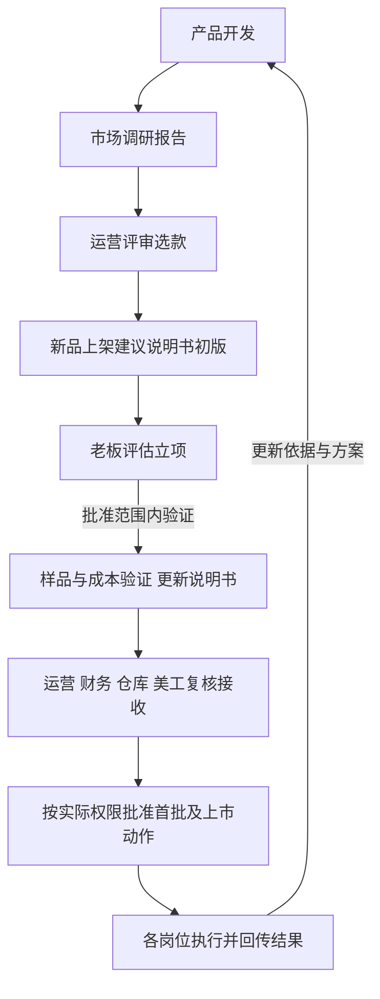

# 03.03｜产品开发管理职责说明书

**核心目标：向运营交付值得验证、能够落地的新品。**

**两份核心输出：《市场调研报告》和《新品上架建议说明书》。** 前者支持选款与立项判断，后者支持商品定型和上市交接。成本、规格、供应商、检索与样品记录作为支撑附件，具体项目持续更新同一份记录。

**时间重点：建议先将65%的可用人工工时用于初筛、市调和外观检索。** 第3部分列出建议分配；它是待试跑的安排，不是当前实测比例或项目交期承诺。

版本：0.5；更新：2026-10-04；状态：待试跑验证的草案。现实人员、具体阈值、批准及生效日期待确认。

对应会话：[产品开发管理｜WZD](codex://threads/01a0fd56-92ad-7521-9301-6dcafe4161cf)。负责人和实际能力见[02.02｜人员岗位分配与实际能力](../02-组织与人员分工/02.02-人员岗位分配与实际能力.md)，组织关系见[02.01｜公司组织与角色会话对应关系](../02-组织与人员分工/02.01-公司组织与角色会话对应关系.md)。

依据：[01.02｜公司经营画像](../01-公司与负责人画像/01.02-公司经营画像.md) · [01.01｜首席执行官决策画像](../01-公司与负责人画像/01.01-首席执行官决策画像.md) · [05.01｜经营指标定义与计算口径](../05-经营指标与计算口径/05.01-经营指标定义与计算口径.md)。

## 1. 岗位目标和责任边界

### 1.1 负责的核心结果

把市场需求转成具体商品方案，确认需求依据、规格、经济性和供应条件，再交给运营承接。通过样品和经营反馈修正判断；有依据地暂缓或排除候选，也是有效开发成果。

### 1.2 工作范围与边界

开发主导需求分析、选品、产品定义、供应商与样品验证、质量包装标准及上市资料交接。运营负责销售承接和推广；财务复核经济性；仓库当前兼管采购执行和入仓质检；美工负责素材制作。

按用户此前说明，运营选款后由老板结合工作负荷、资金、季节和公司情况决定是否立项；运营与开发共同确认样品。具体金额层级、规格变更、首单、付款及退出批准人仍待确认。专业合规结论由适用负责人员复核。

## 2. 两份核心输出和跨岗沟通

### 2.1 市场调研报告

**交付时点**：初筛与市调完成，进入运营选款评审时。

**主要接收人**：运营用于选款和安排测试；老板用于评估方向与是否进入立项。

正文按六点组织：

1. **结论**：推荐哪些站点、尺寸、款式、材质及候选件数，优先级是什么。
2. **需求依据**：样本、来源、日期、统计口径及客户场景。
3. **竞争与进入机会**：竞品价格、趋势、评价基础、新品表现和品牌集中度。
4. **推荐理由与反对证据**：为什么做，哪些证据可能推翻判断，哪些方向暂缓。
5. **经济性初步边界**：价格和费用参考、已知成本、缺项及敏感变量；成本不足时明确待核算。
6. **下一步**：运营应选择什么、需要验证什么、补什么资料，以及谁接收。

原始市调表、分类透视及计算是附件。报告应让接收人能够判断“优先评审哪几个具体商品”，不只展示数据。

### 2.2 新品上架建议说明书

**交付时点**：运营选款后建立初版，用于立项讨论；样品、成本和交付条件更新后形成上市交接版，同一文档保留版本。

**主要接收人**：运营、财务、仓库、美工和老板。标题不代表已经批准或具备上架条件；首页注明当前版本、建议结论和未通过的条件。

正文按六点组织：

1. **上架建议与目标**：目标站点、店铺、用户、具体SKU及建议上架、小范围验证或暂缓的理由。
2. **产品定义**：确认或待确认的尺寸、材料、功能、颜色、件数、包装及样品版本。
3. **售价与盈利条件**：可实现售价、成本、费用、利润情景及投入需求，由财务复核。
4. **供应与质量条件**：供应商、MOQ、交期、样品测试、包装实测、知识产权及专业复核状态。
5. **上市与推广承接**：首批数量和可售窗口建议、素材及卖点证据；推广安排与观察、停止条件由运营提供或确认。
6. **岗位待办与批准状态**：各岗位接收事项、负责人、日期依据、未决问题及批准记录。

规格书、成本表、供应商报价、样品及检索记录作为附件。资料缺失时保留待补，不把初版写成“可以直接上架”。

### 2.3 接收岗位需要给出的反馈

1. **运营**：确认测试规格、销售承接、推广与停止条件，并回传经营反馈。
2. **财务**：确认费用口径、利润与资金条件，指出缺项。
3. **仓库**：接收确认规格及质量包装要求，核对采购、质检、物流和可售条件。
4. **美工**：接收样品及已核实卖点，确认素材需求和交付条件。
5. **老板**：依据方案决定立项及超出现行授权的事项。

数据提供方确认原始来源和采集规则；实际执行、接收和批准分别记录。材料发送不等于接收完成，AI建议不代替部门承诺。

详细推进和未通过时的处理见主流程；图中批准节点不代表已经取得本项目批准。

## 3. 工作流程和时间分配

### 3.1 建议人工工时分配

这是针对当前单人开发、三个重工作模块提出的初始试跑建议。以每周实际可用人工工时为100%，按以下类别记账，避免重复计时；不是行业基准或已经批准的绩效要求。

| 工作类别 | 建议占比 | 主要产出 |
| --- | ---: | --- |
| 商品初步筛选 | 15% | 候选范围与排除理由 |
| 市场调研与分析 | 35% | 市场调研报告 |
| 外观检索与风险初筛 | 15% | 两份核心文档的风险依据及检索附件 |
| 规格、供应商与样品验证 | 25% | 上架建议说明书中的产品和供应依据 |
| 上架交接与经营复盘 | 10% | 说明书交接、反馈与推荐修订 |
| **合计** | **100%** | **两份核心输出及其附件** |

上述65%对应用户说明的主要工作负担，并非实际统计。岗位间沟通、文档整理、复核和返工按所属事项计入；例如选款沟通计入市调，样品协调计入样品验证。

### 3.2 时间如何管理

1. **先记录、再校准**：建议先记录两个完整工作周，核对实际占比、积压和交付质量，再调整分配；这不是已安排的自动任务。
2. **按项目阶段调整**：样品集中到达或上市窗口临近时，可临时提高验证与交接投入，记录被推迟的调研事项和影响。
3. **分开人工与等待**：供应商寄样、生产、运输等待按日历时间单列；期间可推进其他候选，不能把等待天数算成人工工时。
4. **按可售窗口倒排**：具体项目的样品、生产、运输和上架日期由实际交期决定；公司自述开发与生产30—40天仅为参考，不能据此承诺完整可售周期。

项目阶段排期在[04.03｜新品开发与上市交接流程](../04-跨岗位工作流程/04.03-新品开发与上市交接流程.md)第5部分维护。负责人和实际容量未确认前，不设固定月产出或统一交付天数。

### 3.3 流程与核心文档的关系

**框定范围 → 初筛与市调 → 交市场调研报告 → 运营选款与商业初筛 → 上架建议说明书初版 → 老板立项评估 → 样品及成本验证 → 更新说明书并交接 → 按批准范围采购、上市 → 销售反馈回写。**

完整八阶段、整改和暂缓处理以主流程为准；推广和退出见[04.04｜新品推广与退出评估流程](../04-跨岗位工作流程/04.04-新品推广与退出评估流程.md)，采购和质检见[04.05｜采购质检与发货流程](../04-跨岗位工作流程/04.05-采购质检与发货流程.md)。

## 4. 能力要求和匹配标准

### 4.1 七项专业能力

1. **需求判断**：解释客户场景、问题和差异；评论是线索，不直接等同市场规模。
2. **数据分析**：处理父子体、混装、件数、单位和缺失值，保留来源与口径，推荐可追溯、可复算。
3. **商业测算**：完成粗估及样品后复核，统一币种费用口径，解释敏感变量，未知成本不填零。
4. **产品与质量定义**：规格可用于打样及复测，材料、性能、包装和检验要求清楚，版本整改可追溯。
5. **供应与项目推进**：比较报价、MOQ、交期、产能和备选供应，管理等待返工，区分到货与可售。
6. **风险识别**：记录知识产权及合规检索范围、日期、相似设计和未决项，识别需专业复核的问题。
7. **复盘学习**：对照当时信息与实际结果，区分需求、产品、运营和物流因素，提出下一次验证动作。

### 4.2 能力如何检验

辅助开发按规则整理跟踪，重要判断需指导；独立开发能完成单项目分析、定义、商业初筛、打样及交接，并解释取舍；成熟开发能跨项目排序并改进方法。

当前岗位以独立开发能力作为建议培养方向。用正常交付、延期返工、经营结果不理想各一例检验；缺资料时只判断证据覆盖的能力。现实负责人和接收岗位确认，HR在人岗记录登记“可独立、需指导、未验证”及适用范围，不直接依据岗位要求评定现任者。

## 5. 验收和日常检查

### 5.1 两份核心文档的验收

1. **市场调研报告**：运营能据此评审具体商品，数据和推荐可复核；不确定项和反对证据明确。
2. **新品上架建议说明书**：接收岗位能据当前版本确定自己需要确认或执行的事项；规格、成本、样品及上市条件的状态清楚。

资料工作完成、接收合格、经营成功分别检查。调研完成不等于利润或样品通过，上架建议也不代替执行批准。

### 5.2 项目状态与检查重点

验收用“通过、需补充、返工、待观察”，记录理由及下一步。使用[07.04｜任务验收与复盘填写模板](../07-填写模板/07.04-任务验收与复盘填写模板.md)，保存阶段、具体规格、文档版本、现实负责人、接收意见、期限依据和依赖。

建议按工作周检查核心输出进度、未决问题和工时偏差；实际汇报频次由负责人确认。规格、成本或窗口变化时重核受影响阶段；异常按既定路径升级。有依据排除候选也是有效交付，经营结果按岗位可控因素复盘。

公司级事项引用核心文档，再按[07.03｜公司决策与角色评估填写模板](../07-填写模板/07.03-公司决策与角色评估填写模板.md)说明资源、承接、风险和需老板决定的问题，注明AI初评或真实确认。

## 6. AI协作和方法维护

### 6.1 Agent如何支持核心输出

**任务与原始资料 → 数据核对及交叉分析 → 生成或更新核心文档 → 开发与接收岗位复核 → 按实际权限批准执行 → 反馈回写。**

按项目阶段交付市场调研报告或上架建议说明书，避免把大量独立说明当成同等核心成果。读取角色、流程和必要事实；计算使用可复算工具，说明来源、假设、反对证据、缺项及当前阶段。保留原推荐，不将新增信息补写成当时已经知道。

具体操作见[04.10｜产品开发智能辅助调研与验证流程](../04-跨岗位工作流程/04.10-产品开发智能辅助调研与验证流程.md)，共同约定见[08.01｜智能助手协作与权限规则](../08-智能助手协作规则/08.01-智能助手协作与权限规则.md)。

### 6.2 效果和维护

效率包含复核返工工时；质量检查关键字段、遗漏及推荐修正原因；经营结果按约定窗口核对销量、持续利润和回收。当前为本地Excel及人工发起分析，自动采集、接口和后台提醒尚未配置或验证。

四份成功、失败案例已分析，但目录标签不代替真实经营核验。防尘罩的现有报告、候选、成本样品缺项和下一步在[06.03｜欧洲防尘罩开发验证记录](../06-决策方案与执行记录/06.03-欧洲防尘罩开发验证记录.md)维护；此前未完整计时，不补造节省比例或成功率。

负责人用真实案例完善本说明，记录依据、影响和验证方法。职责、权限、预算及绩效制度变更按公司规则审核，保留批准及生效日期；模板见[07.01｜岗位职责说明书填写模板](../07-填写模板/07.01-岗位职责说明书填写模板.md)。

本版本根据用户对核心输出与时间重点的补充重排，工时占比为建议试跑值，尚无现实岗位确认或实测结果。
