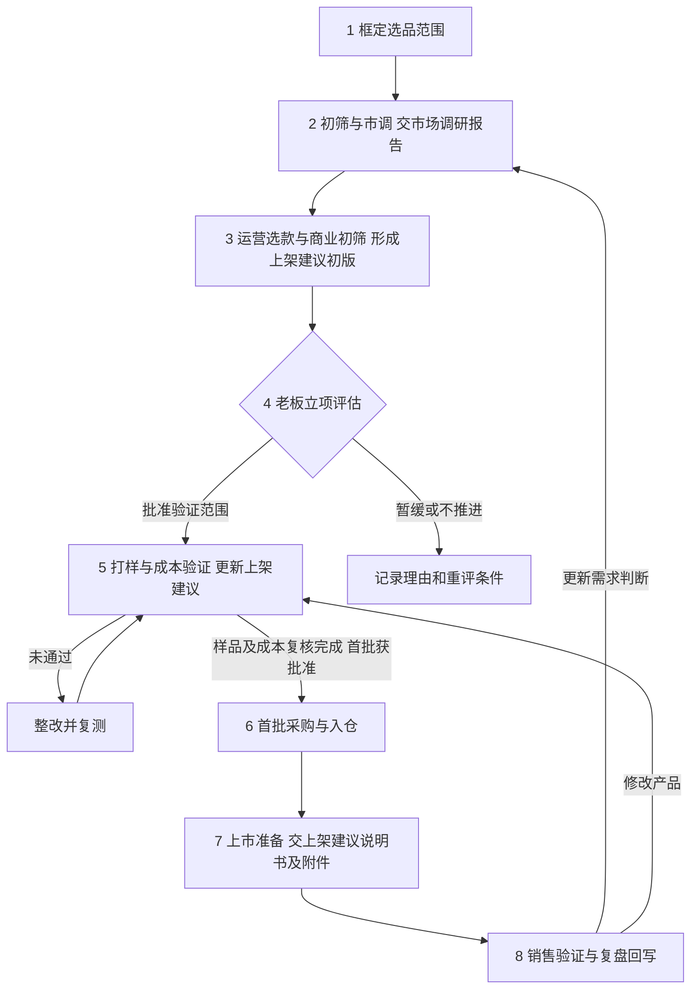

# 04.03｜新品开发与上市交接流程

状态：待试跑验证的草案；版本：0.4；更新：2026-10-04；生效日期：待 CEO 审核与现实负责人确认。关联：[04.00｜工作流程索引](04.00-工作流程索引.md) · [01.02｜公司经营画像](../01-公司与负责人画像/01.02-公司经营画像.md) · [02.02｜人员岗位分配与实际能力](../02-组织与人员分工/02.02-人员岗位分配与实际能力.md)。

**核心交付只有两份：《市场调研报告》支持选款与立项，《新品上架建议说明书》随验证更新并支持上市交接。** 原表、报价、规格及样品记录作为附件。先看第二部分流程图和第三部分交接节点；人工工时分配见[03.03｜产品开发管理职责说明书](../03-岗位职责说明书/03.03-产品开发管理职责说明书.md)，项目排期见本流程第5部分。

## 1. 流程输入和最终交付

| 流程信息 | 内容 |
| --- | --- |
| 触发条件 | 运营提出新品需求，或开发发现可供评估的产品机会 |
| 必要输入 | 目标站点、小组需求、品类方向、候选资料、成本规格与资源 |
| 拟定流程负责人 | 产品开发管理；实际人选与备份待人岗记录确认 |
| 最终交付 | 新品上架建议说明书的上市交接版、支撑附件及运营、财务、仓库、美工的接收确认 |
| 记录位置 | 对应工作表或 ERP；公司级事项在决策文档登记，原始资料在 09-原始资料与案例 引用 |

## 2. 开发流程图

流程图展示推进和反馈关系，采购、变更、追加投入等仍按第三部分及现行批准条件执行。

## 3. 分阶段操作和交接

| 步骤 | 执行岗位 | 交付物 | 检验标准 | 接收或批准 |
| --- | --- | --- | --- | --- |
| 1 框定选品范围 | 运营、产品开发 | 范围、需求单与机会说明 | 站点、品类、场景、承接小组及排除范围明确 | 运营与开发共同确认 |
| 2 初筛与市场调研 | 开发；数据支持及运营配合 | 市场调研报告，附市调原表、具体候选及计算依据 | 原始资料与日期可追溯；维度排名落实到具体产品组合，记录反对证据、数据异常及待验证假设 | 开发复核；运营接收选款资料，老板评估方向 |
| 3 运营选款与商业初筛 | 运营、开发；财务配合 | 新品上架建议说明书初版：候选规格、粗估利润、验证方式和时间资源 | 售价和费用口径明确；成本缺失不填零；观察、预算及停止条件的未决项列清 | 运营确认承接；财务复核经济性 |
| 4 老板立项评估 | 开发和运营提交，老板决定 | 立项意见、批准范围及验证投入记录 | 核对工作负荷、资金、季节和公司条件；列明可执行动作与尚不能执行的动作 | 按用户此前说明由老板判断；具体金额层级待确认 |
| 5 供应商打样与验证 | 开发、运营；仓库采购接口 | 更新上架建议说明书，附报价比较、样品版本、规格、测试和整改记录 | 按规格复测；实测包装尺寸重量；更新成本；反馈回写调研 | 运营与开发确认样品；财务复核更新成本；采购审批按实际权限 |
| 6 首批采购与入仓 | 运营提出需求；仓库协调供应商 | 核定首批方案、采购、大货验收及异常记录 | 首批投入已获批准；与确认样品规格核对；待检和不合格隔离 | 采购付款按现行批准；仓库验收 |
| 7 上市准备与交接 | 开发、运营、财务、美工、仓库 | 上架建议说明书上市交接版及附件：产品事实、复核成本、素材需求、货件和真实可售状态 | 资料与实物一致；接收岗位确认各自事项，库存可售与页面上线分别确认 | 各岗确认接收；运营承接上市，专业合规项由适用人员复核 |
| 8 销售验证与复盘回写 | 运营、开发；财务和仓库配合 | 经营反馈、假设对照、继续或整改建议 | 观察窗口明确；实际利润、退货、推广、库存因素分别分析，更新开发依据 | 推广沿用现行流程；退出或重大追加按已确认权限审批 |

市场调研、商业初筛、样品及上市交接分别验收。依据齐全可建议推进；缺关键输入记录“需补充”，可继续明确范围内的资料工作，但不据此声称后续关口通过。样品不符记录“返工”；经营窗口或样本未成熟记录“待观察”。老板可以批准有限的进一步验证，但这不等于已确认盈利或批准规模采购。

每个项目沿用一份项目记录和原始工作表，写明当前阶段、实际责任人、输入、交付版本、接收人、结论及原因、下一步、期限依据和依赖。规格、成本或上市窗口改变时，重核受影响的关口，并保留变更前后依据。示例见[06.03｜欧洲防尘罩开发验证记录](../06-决策方案与执行记录/06.03-欧洲防尘罩开发验证记录.md)，分析操作见[04.10｜产品开发智能辅助调研与验证流程](04.10-产品开发智能辅助调研与验证流程.md)。

## 4. 已知做法和专业检查

现状来自[01.02｜公司经营画像](../01-公司与负责人画像/01.02-公司经营画像.md)及用户在产品开发会话说明的六步流程。[开发流程原表](../09-原始资料与案例/09.02-产品开发流程原表/产品开发流程.xlsx)已由本职能会话分析，具体现场执行、审批及工时仍待现实负责人核对。开发和生产约30–40天及头程时效均为参考，完整周期还需核对等待、返工、签收和可售，不据此承诺固定上市日期。

### 4.1 产品验证的专业检查

1. **机会定义**：明确目标用户、使用场景、待解决问题、备选方案及放弃理由。把评论和客服反馈当作线索，不能直接当作市场规模；记录竞品样本的站点、价格、规格、差评主题和观察日期，再用访谈、小批量测试等验证需求与差异化。
2. **商业初筛**：估算目标售价、落地成本、适用履约模式的平台与仓储费用、广告和退货压力；包装后的重量尺寸、备货量及周转速度一并纳入测算，与财务共同做乐观/基准/保守情景。站点与品类未确定前，不套用固定费率。
3. **产品规格**：形成必须具备、可选、禁止妥协三类要求；写清尺寸、材料、性能、包装、检验方法与验收标准。对安全、耐久和常见误用场景制定可复测的测试方案，记录样品版本与问题整改结果。
4. **供应商与打样**：比较报价、最小起订量、交期、产能、质量体系和替代供应；核对模具与设计归属、报价有效期及变更条件。按样品问题闭环，并通过试产和批次检验确认一致性，不以口头承诺代替验证。
5. **上市关口**：按目标站点和产品属性核对适用认证、标签、知识产权、平台上架及运输要求，保存核查依据和日期；完成试产、质检、图片素材、Listing 信息、适用履约模式的包装与入仓准备、首批备货确认。合规结论需由适用领域的专业机构或负责人员复核。
6. **上市复盘**：按约定窗口跟踪转化、退货及缺陷原因、真实贡献利润、库存周转和用户反馈；决定继续补货、修改产品、扩展变体或停卖。扩品前复用已验证的需求与供应能力，同时重新核对变体自身的成本、合规及质量风险。

## 5. 时间安排和异常处理

**人工工时与项目日历分别管理。** 每周人工投入的建议比例在角色说明书第3部分维护；以下安排项目交付节点，不重复设置另一套比例。当前未有实测工时，不设统一交付天数。

| 阶段 | 如何安排时间 | 节点交付 |
| --- | --- | --- |
| 1—2 范围、初筛与市调 | 按候选数量、数据可用性和检索范围估工时，与运营约定报告评审日期 | 市场调研报告 |
| 3—4 选款、商业初筛与立项 | 安排运营与财务复核，再约定老板评审；补资料和等待评审单列 | 上架建议说明书初版及立项意见 |
| 5 供应商、样品与成本验证 | 依据供应商确认的打样和寄样时间安排；开发沟通、实测与返工工时分别记录 | 更新说明书、样品和成本复核结果 |
| 6—7 采购、入仓与上市交接 | 从目标可售窗口倒排生产、运输、入仓及素材；按实际依赖安排可并行事项 | 说明书上市交接版、接收确认及可售状态 |
| 8 销售验证与复盘 | 运营确认观察窗口和所需数据；窗口结束后对照原假设复盘 | 经营反馈及核心文档修订 |

每个项目记录预计交付日、日期依据、实际完成日、人工工时、外部等待及下一接收人。寄样、生产、运输等等待不计入开发人员工时；等待期间可推进其他候选。交期、规格或上市窗口变化时，更新排期并说明影响。

缺输入、交付未验收、成本变化、返工或时间偏差时，记录影响、责任与下一步；超出现行权限或涉及安全等异常按明确路径升级。

## 6. 完成验收和后续完善

最终上市交付齐全、接收人确认、遗留问题责任和跟踪明确后记录开发交接完成；经营验证仍按约定窗口继续，不因交接完成而计为商业成功。采用[07.04｜任务验收与复盘填写模板](../07-填写模板/07.04-任务验收与复盘填写模板.md)，分别检查动作、交付质量和经营结果。推广及退出操作以[04.04｜新品推广与退出评估流程](04.04-新品推广与退出评估流程.md)为准，产品反馈回写本项目原表。

### 6.1 负责人需要确认的事项

确认真实执行、批准和验收人；补输入清单、工作表位置、量化标准与时间；用正常、延期返工、结果不理想各一例试跑。责任、权限、预算或绩效变化需获批准，记录版本及生效依据。

本版本将两份核心文档落实到阶段交接，并补充人工工时与项目排期的区分。跨岗位接收、现实责任人及阈值需分别核对，当前未记录采购、投放或人员考核的新批准。
