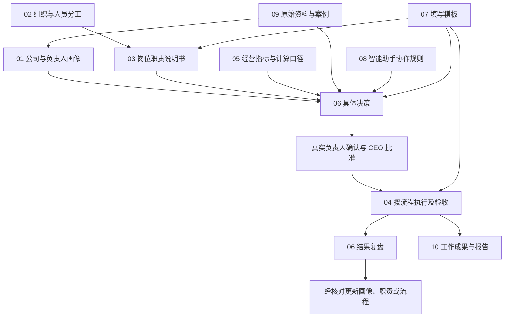

# 00｜公司管理总入口与使用说明

**本页解决三个问题：到哪里查、内容怎么写、由谁维护。**第一次使用先看第 1、2 节；补充职责或新事项时看第 4—8 节。具体事实、岗位要求、操作和批准记录进入对应文件。

原 README 与“公司管理架构描述方法”已合并到本页，后者不再单独维护。根目录保留 README.md，方便 GitHub 自动展示；其他管理文档采用中文编号名称。专业缩写说明：首席执行官（CEO）、人力资源（HR）、智能助手（Agent）、关键绩效指标（KPI）。

结构更新：2026-10-04。编号调整不改变经营事实、现实任命或批准状态；新增或尚未确认的职责与流程保持原草案状态。

## 1. 快速找到要用的文档

| 你要做什么 | 直接打开 |
| --- | --- |
| 了解 CEO 怎样管理公司，并进入三个核心文档 | [03.01｜首席执行官管理职责说明书](03-岗位职责说明书/03.01-首席执行官管理职责说明书.md) |
| 补充 CEO 的经历、判断与偏好 | [01.01｜首席执行官决策画像](01-公司与负责人画像/01.01-首席执行官决策画像.md) |
| 更新公司业务、人员和资源现状 | [01.02｜公司经营画像](01-公司与负责人画像/01.02-公司经营画像.md) |
| 查现实组织、负责人和会话对应关系 | [02.01｜公司组织与角色会话对应关系](02-组织与人员分工/02.01-公司组织与角色会话对应关系.md) |
| 查实际人岗、能力证据、负荷与备份 | [02.02｜人员岗位分配与实际能力](02-组织与人员分工/02.02-人员岗位分配与实际能力.md) |
| 找某个岗位的工作范围和输出要求 | [03.00｜岗位职责索引](03-岗位职责说明书/03.00-岗位职责索引.md) |
| 查具体工作怎样启动、交接和验收 | [04.00｜工作流程索引](04-跨岗位工作流程/04.00-工作流程索引.md) |
| 核对利润、绩效及其他数字的定义 | [05.01｜经营指标定义与计算口径](05-经营指标与计算口径/05.01-经营指标定义与计算口径.md) |
| 查看某项方案、批准及执行进度 | [06.00｜决策事项索引](06-决策方案与执行记录/06.00-决策事项索引.md) |
| 新建或细化职责、流程、决策与复盘 | 本页第 4—7 节的四份填写模板 |
| 确认每个会话负责什么、哪些文件由谁维护 | [08.02｜智能助手职责与文档维护分工](08-智能助手协作规则/08.02-智能助手职责与文档维护分工.md) |
| 查原始资料、案例和验证状态 | [09.00｜原始资料与来源索引](09-原始资料与案例/09.00-原始资料与来源索引.md) |
| 查看已完成的欧洲防尘罩调研报告 | [欧洲防尘罩市场调研报告（本地）](10-工作成果与报告/10.01-产品开发调研报告/欧洲防尘罩市场调研报告_20261003.docx) |

市场调研案例大表及已有报告当前仅保留本地，尚未纳入远程提交。资料索引注明适用范围和验证状态，目录中的“成功／失败”不直接证明原因或实际经营结果。

## 2. 目录怎样分工

| 编号与目录 | 保存的内容 | 回答的问题 |
| --- | --- | --- |
| 01-公司与负责人画像 | 公司条件与个人判断依据 | 公司现在怎样？CEO 为什么这样判断？ |
| 02-组织与人员分工 | 实际组织、人岗与会话关系 | 谁负责？谁能承担？找哪个会话？ |
| 03-岗位职责说明书 | 长期职责、专业能力、输出与边界 | 这个岗位要完成什么？ |
| 04-跨岗位工作流程 | 具体动作、交接、异常与验收 | 这项工作怎样做、怎样交给下一岗？ |
| 05-经营指标与计算口径 | 统一公式、统计范围和样本解释 | 这些数字怎样算、能否比较？ |
| 06-决策方案与执行记录 | 具体事项的方案、批准、任务与结果 | 这次选择什么、由谁落实？ |
| 07-填写模板 | 负责人初始化、细化及复盘工具 | 新内容用什么格式写？ |
| 08-智能助手协作规则 | 会话职责、读取、维护与权限 | 每个助手做什么、维护什么？ |
| 09-原始资料与案例 | 原始表格、来源和历史业务证据 | 判断依据从哪里来？ |
| 10-工作成果与报告 | 已生成报告等交付物 | 完成的成果在哪里查看？ |

### 2.1 编号与命名规则

- 目录用“分类编号-用途”，例如 03-岗位职责说明书。
- 管理文档用“分类编号.文件编号-具体作用.md”，例如 03.03-产品开发管理职责说明书.md。
- 文件编号 00 用于该目录索引；普通文件从 01 开始。已有编号保持稳定，新增文件接续编号，便于引用。
- 原始表格、报告保留来源文件名，其存放文件夹编号并说明用途；日期或专业缩写属于原始资料名称。
- 角色按职责命名，不因换人更名。决策注明具体事项和必要年份；流程注明完整工作范围。
- 编号便于定位，不表示审批顺序、管理级别或已经生效。实际依赖和批准人在正文说明。

### 2.2 当前完整文件结构

```text
README.md  00｜公司管理总入口与使用说明
01-公司与负责人画像/
  01.01-首席执行官决策画像.md
  01.02-公司经营画像.md
02-组织与人员分工/
  02.01-公司组织与角色会话对应关系.md
  02.02-人员岗位分配与实际能力.md
03-岗位职责说明书/
  03.00-岗位职责索引.md
  03.01-首席执行官管理职责说明书.md
  03.02-运营管理职责说明书.md
  03.03-产品开发管理职责说明书.md
  03.04-仓库管理职责说明书.md
  03.05-美工设计职责说明书.md
  03.06-财务管理职责说明书.md
  03.07-人力资源管理职责说明书.md
  03.08-数据支持职责说明书.md
04-跨岗位工作流程/
  04.00-工作流程索引.md
  04.01-公司决策讨论与任务分派流程.md
  04.02-运营计划与绩效复盘流程.md
  04.03-新品开发与上市交接流程.md
  04.04-新品推广与退出评估流程.md
  04.05-采购质检与发货流程.md
  04.06-图片制作与验收流程.md
  04.07-月度利润核算与异常反馈流程.md
  04.08-招聘培训与能力验收流程.md
  04.09-重大经营异常处理流程.md
  04.10-产品开发智能辅助调研与验证流程.md
05-经营指标与计算口径/
  05.01-经营指标定义与计算口径.md
06-决策方案与执行记录/
  06.00-决策事项索引.md
  06.01-2027年营业额规划与执行记录.md
  06.02-欧洲新小组扩张方案与执行记录.md
  06.03-欧洲防尘罩开发验证记录.md
07-填写模板/
  07.01-岗位职责说明书填写模板.md
  07.02-工作流程填写模板.md
  07.03-公司决策与角色评估填写模板.md
  07.04-任务验收与复盘填写模板.md
08-智能助手协作规则/
  08.01-智能助手协作与权限规则.md
  08.02-智能助手职责与文档维护分工.md
09-原始资料与案例/
  09.00-原始资料与来源索引.md
  09.01-员工绩效考核原表/
    KPI-绩效考核表 -刘明发202608.xlsx
  09.02-产品开发流程原表/
    产品开发流程.xlsx
  09.03-画像问答来源与更新记录-20261003.md
  09.04-产品开发成功案例/
    26.9.22-防尘罩-欧洲  市场数据调研表.xlsx
    26.9.24-皮革垫-US  市场数据调研表.xlsx
  09.05-产品开发失败案例/
    （2.8-吸水垫-US）市场数据调研表.xlsx
    （25.4.1-厨房吸水垫-US）市场数据调研表.xlsx
10-工作成果与报告/
  10.01-产品开发调研报告/
    欧洲防尘罩市场调研报告_20261003.docx
```

## 3. 文档之间怎样建立联系

**公司组织结构、文档分类、实际人员和角色会话分别记录，通过链接关联。**一名员工可能承担多个职责，一条流程可能跨多个岗位；职责说明书数量不直接等于人数或会话数。



### 3.1 CEO 三个文档

| 文档 | 用途 | 更新时机 |
| --- | --- | --- |
| 首席执行官管理职责说明书 | CEO 需要组织、决定、协调和检查什么 | 管理责任、方法及实际授权变化 |
| 首席执行官决策画像 | CEO 如何判断、为何这样取舍 | 补经历、确认或修正个人原则 |
| 公司经营画像 | 公司当前有哪些条件、资源和限制 | 经营条件与事实变化 |

公司画像提供条件，个人画像提供判断依据，管理职责用于组织讨论和检查；具体批准、预算与任务在当次决策记录维护。CEO 可以在同一会话输入，由助手分类整理并说明更新去向。计划增加人员不直接改成已经增加。

### 3.2 每类信息在哪里完整维护

当前事实在画像，任职和真实能力在人员分工，长期岗位要求在职责说明书，操作和交接在流程，公式在经营口径，当次批准与结果在决策，来源文件在原始资料。

其他文档写本场景的接口、必要摘要和链接。决策保留当时日期和条件；当前事实改变后，不改写当时已经知道的内容。

例如 HR 的完整职责在 [03.07｜人力资源管理职责说明书](03-岗位职责说明书/03.07-人力资源管理职责说明书.md)；公司画像记录人员现状，人岗记录实际承担者，招聘流程记录交接步骤，扩张决策记录这次要招几人。更详细的维护分工见 [08.02｜智能助手职责与文档维护分工](08-智能助手协作规则/08.02-智能助手职责与文档维护分工.md)。

## 4. 怎样描述岗位职责和能力

采用 [07.01｜岗位职责说明书填写模板](07-填写模板/07.01-岗位职责说明书填写模板.md)。每份说明书包含六部分：

| 部分 | 写清什么 | 检查方法 |
| --- | --- | --- |
| 1 角色定位与责任边界 | 服务对象、负责事项、交接终点、权限及升级路径 | 上下游知道什么事情找本岗、什么需要批准 |
| 2 能力与结果要求 | 要解决的问题、判断方法、输入、交付及证据 | 能用实际工作样本核对是否达到要求 |
| 3 工作流程与协作接口 | 关联流程、本岗动作、上游输入及下游接收 | 接收对象和可用条件明确 |
| 4 日常管理与检查 | 计划、记录、汇报、异常发现和纠偏 | 能发现偏差并确定下一步 |
| 5 参与公司决策的要求 | 专业意见、任务、资源、依赖及待决策项 | CEO 可以比较和汇总各方建议 |
| 6 智能助手协作与维护约定 | 读取依据、事实核实、权限、补数和迭代 | 建议、现实承接与批准有清楚边界 |

### 4.1 能力必须对应工作与证据

按“**工作问题 → 所需能力与判断方法 → 必要输入 → 交付结果 → 验收标准与证据**”描述。

岗位要求在职责说明书，任职者的实际能力和负荷在人岗记录，智能助手的用途与边界在协作规则。分别核对，不能凭写出要求就认定人员或助手已经具备能力。

“主动性强”具体为发现偏差、分析原因、提出动作并反馈结果。时限和指标有实际依据或批准再填写。动作是否完成、交付是否合格、经营结果如何分别检查；结果尚未成熟则待观察。

## 5. 怎样描述操作流程

采用 [07.02｜工作流程填写模板](07-填写模板/07.02-工作流程填写模板.md)。同一跨岗操作在流程目录维护唯一版本，各岗位引用它。

流程至少写清：

1. **触发与范围**：什么情况下启动，为解决什么问题。
2. **必要输入**：资料、来源、口径及需要的批准。
3. **步骤与交接**：每步动作、执行岗位、交付、检验及接收或批准岗位。
4. **时间与异常**：等待、延期、返工、成本或质量变化如何处理。
5. **完成条件**：交付齐全、接收认可、遗留问题责任明确。
6. **记录位置**：现有系统、工作表或决策记录，证据可追溯。
7. **完善依据**：真实案例、耗时、试跑结果、版本状态。

执行人、推进人、接收人、批准人分别写清；实际人选在人岗或具体任务中指定。发出资料后仍须接收方确认可用性。

## 6. CEO 提出想法后怎样组织讨论

采用 [07.03｜公司决策与角色评估填写模板](07-填写模板/07.03-公司决策与角色评估填写模板.md)，具体操作见 [04.01｜公司决策讨论与任务分派流程](04-跨岗位工作流程/04.01-公司决策讨论与任务分派流程.md)。

工作顺序：**CEO 明确目标与约束 → 六职能独立评估和细拆任务 → 核对依赖与分歧 → 真实负责人确认 → CEO 批准 → 执行与验收 → 复盘。**

各职能统一回复七项：结论、依据与反对证据、本岗任务、资源与承接能力、跨岗依赖、风险及检查停止条件、需 CEO 决定的事项；另注明意见来源、日期和确认状态。

智能助手初评、真实负责人确认、CEO 批准、实际执行分别记录。未收到意见保持“未返回”；任务未确认不能写成部门承诺。验收与复盘使用 [07.04｜任务验收与复盘填写模板](07-填写模板/07.04-任务验收与复盘填写模板.md)。

会话身份及绑定以 [02.01｜公司组织与角色会话对应关系](02-组织与人员分工/02.01-公司组织与角色会话对应关系.md)为准。共用文件提供上下文，分析前读取当前内容；消息发送和实际业务操作按已有授权处理，链接不等于自动同步或调度。

## 7. 怎样写得清楚、可检查

### 7.1 区分事实和要求

| 类型 | 必要说明 |
| --- | --- |
| 已核实事实 | 证据、核对人、时间及适用范围 |
| 自述或估算 | 谁说明、怎样估计、待核项 |
| 假设 | 成立条件和验证方法 |
| 现行做法 | 当前实际动作与已知边界 |
| 建议或草案 | 理由、影响、待审核项 |
| 已批准要求或决定 | 批准人、范围、生效日期和依据 |

未知项写待确认，指出向哪个岗位补什么信息，缺失数值不填零。指标说明主体、期间、币种、分子分母和来源，统一引用经营口径。

### 7.2 建议的描述句式

> 当【触发条件】发生时，【岗位／实际负责人】使用【输入】，完成【动作】，向【接收人】交付【结果】；以【证据和标准】验收。超出【边界】时报告【批准或升级岗位】。

### 7.3 产品开发的信息分工示例

以下仅说明整理方法，不宣布新项目已批准：

| 内容 | 记录位置 |
| --- | --- |
| 开发供给、供应和资源限制 | 公司经营画像 |
| CEO 为何选择、怎样取舍 | 具体决策；可复用原则经确认再更新个人画像 |
| 产品机会、成本判断和上市资料要求 | 产品开发职责说明书 |
| 由谁开发、能力和可用时间怎样 | 人员岗位分配与实际能力 |
| 样品、质量、素材、库存怎样交接 | 新品开发与上市交接流程 |
| 首单、预算、立项及退出的批准 | 具体决策记录 |
| 调研底稿与测试依据 | 原始资料与案例 |
| 完成的分析报告 | 工作成果与报告 |
| 实际结果、偏差和改进任务 | 同一项目复盘，按证据提修订 |

## 8. 负责人怎样完善和维护

1. CEO 初始化角色目的、边界、期望结果与约束。
2. 负责人补正常完成、延期返工、结果不理想各一例，说明实际输入、动作、交付、验收、耗时和审批。
3. 上下游核对接口，补实际人员、负荷、接收条件及冲突。
4. 用真实任务试跑，保存过程、交付、结果和返工证据。
5. 提修订，说明改了什么、依据、影响岗位和验证办法。
6. 审核后注明草案、试行或正式状态，记录版本及生效依据。责任、权限、预算或绩效变化按实际授权批准。

智能助手每轮说明分析结果、更新去向、未确认项及下一步。未写文件时明确为讨论建议；编辑、Git 提交、远程推送分别说明状态。新目录和路径不会自动改写旧会话中已发出的文字。

**主维护分工**见 [08.02｜智能助手职责与文档维护分工](08-智能助手协作规则/08.02-智能助手职责与文档维护分工.md)；**共同读取与权限规则**见 [08.01｜智能助手协作与权限规则](08-智能助手协作规则/08.01-智能助手协作与权限规则.md)。
