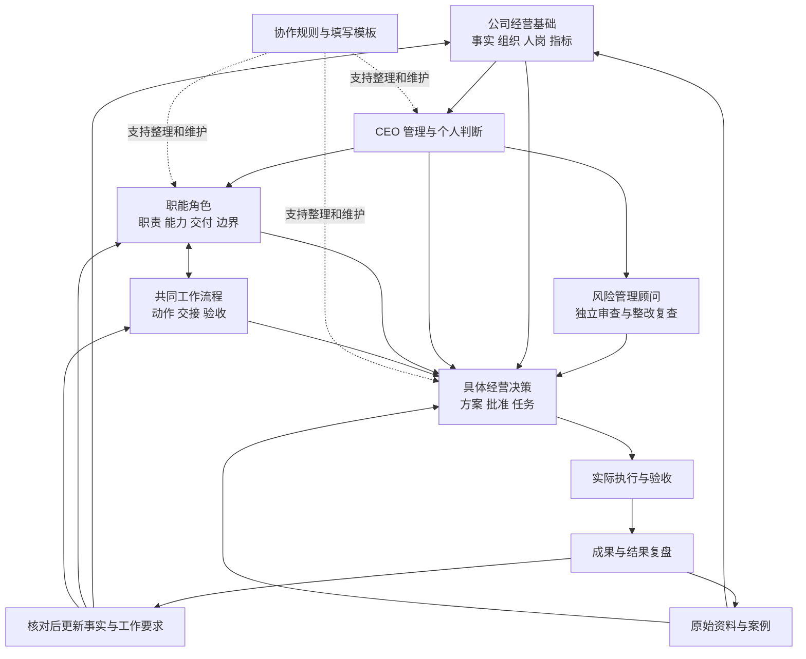

# 公司管理总入口与使用说明

**本页围绕“公司条件与判断 → 角色分工 → 流程协作 → 具体决策 → 执行和复盘”提供入口。**先确认依据和资源，再找负责岗位及交接方法，最终把这次批准、任务与结果保存为事项记录。

结构更新：2026-10-08。目录整理保留原业务内容、案例、版本和批准状态；目录编号用于阅读顺序，实际依赖和权限以正文为准。

角色更新：2026-10-09 新增[风险管理顾问](02-管理角色/09-风险管理顾问/01-职责说明书.md)及[风险台账](02-管理角色/09-风险管理顾问/02-风险台账.md)，直接向 CEO 提供独立意见。各业务岗位继续负责整改，未新增现实人员编制；常驻会话为 CEO、六职能及风险顾问共八个。

## 1. 完整管理关系



岗位和流程是可复用要求，决策记录是这一次的实际安排。提出“想扩张”时，查公司资源和 CEO 判断，找六职能经营评估及风险顾问独立审查，参照流程核对依赖，把批准、任务和实际责任人写入本次事项。结果成熟后复盘，再提出事实或工作要求的更新。

智能助手提供整理与专业初评，现实负责人确认事实和承接，CEO 或已授权批准人决定。读取文件、发送消息及业务操作按具体任务授权处理，链接不代表自动运行。

## 2. 按管理工作进入文档

| 用途与目录 | 入口 | 与下一层的关系 |
| --- | --- | --- |
| 01-公司经营基础 | [公司经营画像](01-公司经营基础/01-公司经营画像.md)；[公司组织与角色会话对应关系](01-公司经营基础/02-组织结构与角色会话.md)；[人员岗位分配与实际能力](01-公司经营基础/03-人员岗位与实际能力.md)；[经营指标定义与计算口径](01-公司经营基础/04-经营指标与计算口径.md) | 为角色判断和具体方案提供当前条件 |
| 02-管理角色 | [岗位职责索引](02-管理角色/00-管理角色与职责索引.md) | 负责人及职能说明职责、能力、交付和权限，引用共同流程 |
| 03-共同工作流程 | [工作流程索引](03-共同工作流程/00-工作流程索引.md) | 规定跨岗动作与交接，具体项目引用适用流程 |
| 04-经营决策与执行 | [决策事项索引](04-经营决策与执行/00-决策事项索引.md) | 记录本次方案、批准、任务、验收和结果 |
| 05-资料与工作成果 | [原始资料与来源索引](05-资料与工作成果/00-资料来源与成果索引.md)；[产品运营小组独立仓库](https://github.com/haoyang877/Amazon-Product-Operations) | 原始资料作为输入，完成的报告作为输出，支持复盘和事实更新 |
| 06-协作规则与填写模板 | [智能助手职责与文档维护分工](06-协作规则与填写模板/02-智能助手职责与文档维护分工.md)；[智能助手协作与权限规则](06-协作规则与填写模板/01-智能助手协作与权限规则.md)及填写模板 | 支持以上内容的创建、讨论和维护，不增加经营审批权限 |

### 2.1 CEO 三个文档怎样连接

| 文档 | 存放位置与用途 |
| --- | --- |
| [首席执行官管理职责说明书](02-管理角色/01-首席执行官/01-职责说明书.md) | CEO 角色目录：需要组织、决定、协调和检查什么 |
| [首席执行官决策画像](02-管理角色/01-首席执行官/02-个人决策画像.md) | 同一 CEO 角色目录：本人依据什么经验与偏好判断 |
| [公司经营画像](01-公司经营基础/01-公司经营画像.md) | 共同公司基础：所有角色都使用的公司事实与资源约束 |

公司事实是全体角色共用的依据，个人画像是 CEO 专有判断依据，因此分别存放。CEO 会话统一接收输入、按类别整理，不把同一信息抄到三个地方。具体决定进入当次事项；计划不提前改成已发生事实。

### 2.2 职能角色为什么独立成目录

每个角色目录保存长期职责和必要的专有判断依据，未来由对应实际负责人细化。实际任职、能力、负荷在公司基础的人岗记录维护；跨岗操作只在共同流程中维护一份。

例如 HR 的职责见 [人力资源管理职责说明书](02-管理角色/07-人力资源管理/01-职责说明书.md)，招聘步骤见 [招聘培训与能力验收流程](03-共同工作流程/08-招聘培训与能力验收流程.md)，这次招聘人数、预算和期限在具体决策。三处分别描述职责、方法和本次安排。

### 2.3 商品经营的阅读链

运营需求与目标 → 产品开发及验证 → 采购质检、素材和可售准备 → 推广经营 → 利润与人员支持 → 复盘。部分环节并行，实际交接和日期按项目条件确认。

从 [运营管理职责说明书](02-管理角色/02-运营管理/01-职责说明书.md) 或 [产品开发管理职责说明书](02-管理角色/03-产品开发管理/01-职责说明书.md) 进入，再看共同流程。以 [欧洲防尘罩开发验证记录](04-经营决策与执行/03-欧洲防尘罩开发验证记录.md) 为例，调研底稿提供证据，开发流程提供验证关口，项目记录保存候选、缺项和批准，报告保存已交付分析。

## 3. 当前目录与维护规则

```text
README.md  管理关系总图、阅读入口与填写方法
01-公司经营基础/
  01-公司经营画像.md
  02-组织结构与角色会话.md
  03-人员岗位与实际能力.md
  04-经营指标与计算口径.md
02-管理角色/
  00-管理角色与职责索引.md
  01-首席执行官/
    01-职责说明书.md
    02-个人决策画像.md
  02-运营管理/01-职责说明书.md
  03-产品开发管理/01-职责说明书.md
  04-仓库管理/01-职责说明书.md
  05-美工设计/01-职责说明书.md
  06-财务管理/01-职责说明书.md
  07-人力资源管理/01-职责说明书.md
  08-数据支持/01-职责说明书.md
  09-风险管理顾问/
    01-职责说明书.md
    02-风险台账.md
03-共同工作流程/
  00-工作流程索引.md
  01-公司决策讨论与任务分派流程.md
  02-运营计划与绩效复盘流程.md
  03-新品开发与上市交接流程.md
  04-新品推广与退出评估流程.md
  05-采购质检与发货流程.md
  06-图片制作与验收流程.md
  07-月度利润核算与异常反馈流程.md
  08-招聘培训与能力验收流程.md
  09-重大经营异常处理流程.md
  10-产品开发智能辅助调研与验证流程.md
  11-亚马逊运营管理流程框架.md
  12-风险审查与整改跟踪流程.md
04-经营决策与执行/
  00-决策事项索引.md
  01-2027年营业额规划与执行记录.md
  02-欧洲新小组扩张方案与执行记录.md
  03-欧洲防尘罩开发验证记录.md
05-资料与工作成果/
  00-资料来源与成果索引.md
  01-原始资料/
    员工绩效原表、开发流程原表、画像问答来源
    成功与失败案例、运营框架原稿
    07-公司经营风险原稿/公司经营店铺营运风险.docx
  02-工作成果/
    产品开发调研报告
06-协作规则与填写模板/
  01-智能助手协作与权限规则.md
  02-智能助手职责与文档维护分工.md
  填写模板/
    01-岗位职责说明书填写模板.md
    02-工作流程填写模板.md
    03-公司决策与角色评估填写模板.md
    04-任务验收与复盘填写模板.md
```

一类信息在其主文件完整维护，其余文件写必要摘要、接口和链接。决策保留当时基线和日期，不用今天的数据改写当时的条件。新增文件按用途进入已有层次，不因一次分析新增一套角色或重复流程。

文档顶部提供返回总入口和分类索引，正文提供关联岗位与流程。复制或移动文件后按新位置重算相对链接；旧会话里已发出的文字不会自动改写。原表和报告保留来源名称及内容，案例大表与已有报告沿用本地保存状态，未因目录调整上传到远程。

下方填写方法继续使用；具体工作要求、任命和授权保持原批准状态。

## 4. 怎样描述岗位职责和能力

采用 [岗位职责说明书填写模板](06-协作规则与填写模板/填写模板/01-岗位职责说明书填写模板.md)。每份说明书包含六部分：

| 部分 | 写清什么 | 检查方法 |
| --- | --- | --- |
| 1 角色定位与责任边界 | 服务对象、负责事项、交接终点、权限及升级路径 | 上下游知道什么事情找本岗、什么需要批准 |
| 2 能力与结果要求 | 要解决的问题、判断方法、输入、交付及证据 | 能用实际工作样本核对是否达到要求 |
| 3 工作流程与协作接口 | 关联流程、本岗动作、上游输入及下游接收 | 接收对象和可用条件明确 |
| 4 日常管理与检查 | 计划、记录、汇报、异常发现和纠偏 | 能发现偏差并确定下一步 |
| 5 参与公司决策的要求 | 专业意见、任务、资源、依赖及待决策项 | CEO 可以比较和汇总各方建议 |
| 6 智能助手协作与维护约定 | 读取依据、事实核实、权限、补数和迭代 | 建议、现实承接与批准有清楚边界 |

### 4.1 能力必须对应工作与证据

按“**工作问题 → 所需能力与判断方法 → 必要输入 → 交付结果 → 验收标准与证据**”描述。

岗位要求在职责说明书，任职者的实际能力和负荷在人岗记录，智能助手的用途与边界在协作规则。分别核对，不能凭写出要求就认定人员或助手已经具备能力。

“主动性强”具体为发现偏差、分析原因、提出动作并反馈结果。时限和指标有实际依据或批准再填写。动作是否完成、交付是否合格、经营结果如何分别检查；结果尚未成熟则待观察。

## 5. 怎样描述操作流程

采用 [工作流程填写模板](06-协作规则与填写模板/填写模板/02-工作流程填写模板.md)。同一跨岗操作在流程目录维护唯一版本，各岗位引用它。

流程至少写清：

1. **触发与范围**：什么情况下启动，为解决什么问题。
2. **必要输入**：资料、来源、口径及需要的批准。
3. **步骤与交接**：每步动作、执行岗位、交付、检验及接收或批准岗位。
4. **时间与异常**：等待、延期、返工、成本或质量变化如何处理。
5. **完成条件**：交付齐全、接收认可、遗留问题责任明确。
6. **记录位置**：现有系统、工作表或决策记录，证据可追溯。
7. **完善依据**：真实案例、耗时、试跑结果、版本状态。

执行人、推进人、接收人、批准人分别写清；实际人选在人岗或具体任务中指定。发出资料后仍须接收方确认可用性。

## 6. CEO 提出想法后怎样组织讨论

采用 [公司决策与角色评估填写模板](06-协作规则与填写模板/填写模板/03-公司决策与角色评估填写模板.md)，具体操作见 [公司决策讨论与任务分派流程](03-共同工作流程/01-公司决策讨论与任务分派流程.md)。

工作顺序：**CEO 明确目标与约束 → 六职能独立评估和细拆任务 → 风险顾问审查 → 核对依赖与分歧 → 真实负责人确认 → CEO 批准 → 执行与验收 → 复盘。**

各职能统一回复七项：结论、依据与反对证据、本岗任务、资源与承接能力、跨岗依赖、风险及检查停止条件、需 CEO 决定的事项；另注明意见来源、日期和确认状态。

智能助手初评、真实负责人确认、CEO 批准、实际执行分别记录。未收到意见保持“未返回”；任务未确认不能写成部门承诺。验收与复盘使用 [任务验收与复盘填写模板](06-协作规则与填写模板/填写模板/04-任务验收与复盘填写模板.md)。

会话身份及绑定以 [公司组织与角色会话对应关系](01-公司经营基础/02-组织结构与角色会话.md)为准。共用文件提供上下文，分析前读取当前内容；消息发送和实际业务操作按已有授权处理，链接不等于自动同步或调度。

## 7. 怎样写得清楚、可检查

### 7.1 区分事实和要求

| 类型 | 必要说明 |
| --- | --- |
| 已核实事实 | 证据、核对人、时间及适用范围 |
| 自述或估算 | 谁说明、怎样估计、待核项 |
| 假设 | 成立条件和验证方法 |
| 现行做法 | 当前实际动作与已知边界 |
| 建议或草案 | 理由、影响、待审核项 |
| 已批准要求或决定 | 批准人、范围、生效日期和依据 |

未知项写待确认，指出向哪个岗位补什么信息，缺失数值不填零。指标说明主体、期间、币种、分子分母和来源，统一引用经营口径。

### 7.2 建议的描述句式

> 当【触发条件】发生时，【岗位／实际负责人】使用【输入】，完成【动作】，向【接收人】交付【结果】；以【证据和标准】验收。超出【边界】时报告【批准或升级岗位】。

### 7.3 产品开发的信息分工示例

以下仅说明整理方法，不宣布新项目已批准：

| 内容 | 记录位置 |
| --- | --- |
| 开发供给、供应和资源限制 | 公司经营画像 |
| CEO 为何选择、怎样取舍 | 具体决策；可复用原则经确认再更新个人画像 |
| 产品机会、成本判断和上市资料要求 | 产品开发职责说明书 |
| 由谁开发、能力和可用时间怎样 | 人员岗位分配与实际能力 |
| 样品、质量、素材、库存怎样交接 | 新品开发与上市交接流程 |
| 首单、预算、立项及退出的批准 | 具体决策记录 |
| 调研底稿与测试依据 | 原始资料与案例 |
| 完成的分析报告 | 工作成果与报告 |
| 实际结果、偏差和改进任务 | 同一项目复盘，按证据提修订 |

## 8. 负责人怎样完善和维护

1. CEO 初始化角色目的、边界、期望结果与约束。
2. 负责人补正常完成、延期返工、结果不理想各一例，说明实际输入、动作、交付、验收、耗时和审批。
3. 上下游核对接口，补实际人员、负荷、接收条件及冲突。
4. 用真实任务试跑，保存过程、交付、结果和返工证据。
5. 提修订，说明改了什么、依据、影响岗位和验证办法。
6. 审核后注明草案、试行或正式状态，记录版本及生效依据。责任、权限、预算或绩效变化按实际授权批准。

智能助手每轮说明分析结果、更新去向、未确认项及下一步。未写文件时明确为讨论建议；编辑、Git 提交、远程推送分别说明状态。新目录和路径不会自动改写旧会话中已发出的文字。

**主维护分工**见 [智能助手职责与文档维护分工](06-协作规则与填写模板/02-智能助手职责与文档维护分工.md)；**共同读取与权限规则**见 [智能助手协作与权限规则](06-协作规则与填写模板/01-智能助手协作与权限规则.md)。
