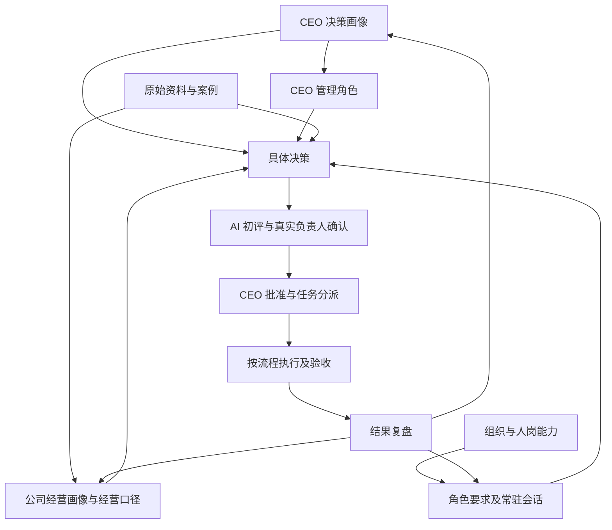

# WZD 公司管理总览

本项目把 CEO 的思考方式、公司现状、岗位能力和实际工作联系起来。本页是总入口；文档按“依据 → 组织与职责 → 流程 → 决策与结果”使用。

**本次调整：2026-10-04。**目录和角色结构已按 CEO 要求整理；新增职责、流程及检验要求为初始草案，待真实负责人细化、试跑和 CEO 审核。没有新增现实任命，也不代表各部门已经承诺执行。

## 一、从哪里开始

| 你要做什么 | 打开哪里 | 维护什么 |
| --- | --- | --- |
| 补充自己的经历与判断规则 | [CEO 决策画像](画像/CEO决策画像.md) | 个人经验、价值取舍、风险与授权偏好 |
| 更新公司现状 | [公司经营画像](画像/公司经营画像.md) | 市场、产品、资源、运行机制与限制 |
| 了解 CEO 如何管理团队 | [CEO 管理角色](roles/CEO管理.md) | 管理责任、能力、协调、决策与检查输出 |
| 找职能、会话和汇报关系 | [组织与会话映射](组织/公司组织架构与角色会话映射.md) | 现实组织、数字团队及唯一会话入口 |
| 确认由谁承担、实际能做多少 | [人岗分配与当前能力](组织/人岗分配与当前能力.md) | 任职、权限、能力证据、负荷与备份；缺项待核 |
| 查具体工作怎样交接 | [流程目录](流程/README.md) | 输入、动作、交付、接收、异常和验收 |
| 分析一项决策并跟踪结果 | [决策目录](决策/README.md) | 六方意见、分歧、CEO 决定、任务与复盘 |
| 核对公式与原始证据 | [经营口径](经营数据与决策口径.md)、[资料目录](docs/README.md) | 指标定义及来源文件 |
| 创建或细化角色 | [角色模板](模板/角色说明书模板.md)、[流程模板](模板/工作流程卡模板.md) | 负责人可填写的统一格式 |
| 了解 AI 如何协作 | [AI 协作约定](协作/AI协作约定.md) | 来源、讨论、现实确认、批准和权限 |

## 二、完整目录结构

```text
README.md                                  公司管理入口
画像/                                      决策依据
  CEO决策画像.md                            个人如何思考与取舍
  公司经营画像.md                           公司当前情况与约束
组织/                                      谁承担职责
  公司组织架构与角色会话映射.md              现实组织和数字会话关系
  人岗分配与当前能力.md                      实际任职、能力证据和容量
roles/                                     可复用的岗位要求
  CEO管理.md                                综合管理与最终决策
  运营.md                                   汇总欧洲与美国业务
  产品开发管理.md                           产品供给与上市交接
  仓库管理.md                               采购执行、仓储与发货
  美工.md                                   素材制作与验收
  财务.md                                   利润、现金与预算核对
  HR.md                                     招聘、培养与组织支持
  数据支持.md                               数据整理质量，无独立会话
流程/                                      跨岗位操作与交接
  README.md
  公司决策讨论与任务分派.md
  运营计划与KPI复盘.md
  新品开发到上市.md
  新品推广与退出评估.md
  采购质检与发货.md
  图片制作与验收.md
  月度利润核算与异常反馈.md
  招聘培训与能力验收.md
  重大经营异常处理.md
模板/                                      负责人填写及迭代工具
  角色说明书模板.md
  工作流程卡模板.md
  公司决策与角色评估模板.md
  任务验收与复盘模板.md
协作/                                      AI 协作规则
  AI协作约定.md
经营数据与决策口径.md                       统一指标定义
决策/                                      每项决策的依据与结果
  README.md
  2027年营业额规划.md
  欧洲新小组扩张.md
docs/                                      原始资料与案例
  README.md
  KPI-绩效考核表 -刘明发202608.xlsx
  画像更新记录-2026-10-03.md
  产品开发流程.xlsx
  产品开发成功案例/                        本地原表，未纳入本次远程提交
  产品开发失败案例/                        本地原表，未纳入本次远程提交
outputs/                                   本地产出文件，未纳入本次远程提交
```

## 三、角色与能力如何联系

每份角色说明书统一包含六部分：**责任边界、能力与结果要求、流程与协作、日常检查、公司决策参与、AI 协作与维护**。能力通过“需要解决的问题 → 所需能力 → 输入 → 交付 → 验收证据”体现；个人素质用于说明行为要求，并须落实到可观察的工作。

岗位要求在角色说明书维护，实际负责人的能力与负荷在人岗记录维护，AI 的用途与边界在协作约定维护。三者分别核对，不能凭一份角色文档认定员工或 AI 已具备全部能力。

CEO 决策画像提供个人判断依据；CEO 管理角色定义岗位责任和团队管理输出。两份文件相互引用，个人偏好不自动成为正式制度。

数字团队仍为 CEO 加六个常驻职能会话；运营统一汇总欧洲与美国。数据支持有岗位说明，但没有新增数字会话；采购执行仍由仓库兼管。角色说明书共八份，不等于新增八名人员。

| 职能 | 角色说明书 | 常驻会话 |
| --- | --- | --- |
| CEO | [CEO 管理](roles/CEO管理.md) | [CEO 决策画像](codex://threads/01a0fb6d-4d44-7732-8ebc-e378c6bf4ae2) |
| 运营 | [运营](roles/运营.md) | [运营主管｜WZD](codex://threads/01a0fb6e-5333-7421-a6fb-692099601d5d) |
| 产品开发 | [产品开发管理](roles/产品开发管理.md) | [产品开发管理｜WZD](codex://threads/01a0fd56-92ad-7521-9301-6dcafe4161cf) |
| 仓库 | [仓库管理](roles/仓库管理.md) | [仓库管理｜WZD](codex://threads/01a0fd56-74ab-7992-8b59-1a174aad20bb) |
| 美工 | [美工](roles/美工.md) | [美工｜WZD](codex://threads/01a0fd56-a978-75f3-b44a-59a903f9c2df) |
| 财务 | [财务](roles/财务.md) | [财务｜WZD](codex://threads/01a0fd47-2df4-7331-ab77-b2576b2e223d) |
| HR | [HR](roles/HR.md) | [HR｜WZD](codex://threads/01a0fd47-5b7f-7652-ade3-a71ce07d8b74) |

## 四、文档之间如何使用



复盘后经确认再更新长期画像、岗位或流程；实际批准仍在具体决策记录保留。文档链接用于查阅，不会自动同步会话或启动业务操作。

## 五、负责人如何细化

1. CEO 初始化角色目的、责任边界和希望收到的结果；现有版本作为起点。
2. 真实负责人用角色模板补正常工作、延期或返工、结果不理想各一例，填写实际输入、交付、验收证据与权限缺口。
3. 跨岗动作写入同一流程卡，分别核对上游、接收人、批准人及异常处理。
4. 用真实任务试跑，记录时间、返工、结果与依赖；能力证据在人岗记录维护。
5. CEO 审核责任、权限、预算与绩效变化，记录批准和生效日期，再作为正式工作要求使用。

一项信息在一处完整维护：个人原则在个人画像，公司现状在公司画像，公式在经营口径，职责在角色说明，操作在流程，具体批准与结果在决策。历史基线保留当时日期；旧记录不覆盖当前规则。
