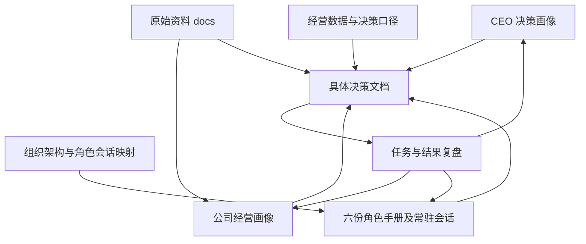

# WZD 公司管理总览

本项目把 CEO 的判断方式、公司实际条件、六个职能和具体决策联系起来。补充背景时更新画像，分派事项时查组织与角色，讨论执行时进入对应决策文档。本页是所有文档的入口。

## 从哪里开始

| 你要做什么 | 打开哪里 | 在这里维护什么 |
| --- | --- | --- |
| 补充自己的经历与判断规则 | [CEO 决策画像](画像/CEO决策画像.md) | 个人经历、价值取舍、用人偏好、试错与授权原则 |
| 更新公司现状与资源 | [公司经营画像](画像/公司经营画像.md) | 人员、市场、产品、供应链、运行机制及能力约束 |
| 找到负责的角色与会话 | [公司组织架构与角色会话映射](组织/公司组织架构与角色会话映射.md) | 现实与数字组织关系、唯一角色会话、历史角色状态 |
| 核对指标、计算与资料 | [经营数据与决策口径](经营数据与决策口径.md) | 利润与毛利、KPI 样本、数据规则和共同输出要求 |
| 分析具体事项并跟踪结果 | [决策目录](决策/README.md) | 方案、六方意见、批准记录、任务与复盘 |
| 查看原始依据 | [资料目录](docs/README.md) | KPI 原表及未来业务、财务、供应链资料 |

## 文档结构

```text
README.md                         公司管理总入口
画像/
  CEO决策画像.md                  CEO 如何判断
  公司经营画像.md                 公司当前有什么能力和限制
组织/
  公司组织架构与角色会话映射.md    谁负责、对应哪份手册和会话
roles/
  运营.md                         六份常驻职责手册
  产品开发管理.md
  仓库管理.md
  美工.md
  财务.md
  HR.md
  财务与HR.md                     旧合并角色的索引
经营数据与决策口径.md             全公司共同规则
决策/
  README.md                       决策索引与维护方法
  2027年营业额规划.md              年度目标讨论与执行记录
  欧洲新小组扩张.md                组织扩张计划与执行记录
docs/
  README.md                       原始资料索引
  KPI-绩效考核表 -刘明发202608.xlsx
```

## 六个常驻角色

数字运营主管统一汇总欧洲和美国两条现实业务线，直接向 CEO 汇报。其余五个职能也向 CEO 提交各自判断。现实人员及数字角色的区别、完整会话映射以组织文档为准；每份角色手册都有对应会话入口。

| 职能 | 职责手册 | 常驻会话 |
| --- | --- | --- |
| 运营 | [运营](roles/运营.md) | [运营主管｜WZD](codex://threads/01a0fb6e-5333-7421-a6fb-692099601d5d) |
| 产品开发 | [产品开发管理](roles/产品开发管理.md) | [产品开发管理｜WZD](codex://threads/01a0fd56-92ad-7521-9301-6dcafe4161cf) |
| 仓库 | [仓库管理](roles/仓库管理.md) | [仓库管理｜WZD](codex://threads/01a0fd56-74ab-7992-8b59-1a174aad20bb) |
| 美工 | [美工](roles/美工.md) | [美工｜WZD](codex://threads/01a0fd56-a978-75f3-b44a-59a903f9c2df) |
| 财务 | [财务](roles/财务.md) | [财务｜WZD](codex://threads/01a0fd47-2df4-7331-ab77-b2576b2e223d) |
| HR | [HR](roles/HR.md) | [HR｜WZD](codex://threads/01a0fd47-5b7f-7652-ade3-a71ce07d8b74) |

## 文档如何配合



## 如何维护

一项信息在一处完整维护，其他文档链接引用。组织人数以公司经营画像为来源；CEO 的长期取舍在个人画像维护；公式和样本解释在经营口径维护；每项计划的批准、任务与结果放在对应决策文档。专项决策里的基线保留当时日期，不随当前公司状态自动覆盖。

公司现状主要来自 CEO 自述，原始经营数据尚不完整。记录要区分事实、自述、估算、计划与建议，注明来源、时间及口径。角色讨论、CEO 批准和现实执行分开记录；后续资料进入原角色会话复核，再更新相应文档。文件链接提供入口，不会自动同步会话内容。

以前被 CEO 撤回的信息不再作为当前公司事实。重要历史选择与结果保留在个人画像的案例中；文档修改历史由 Git 保存。
