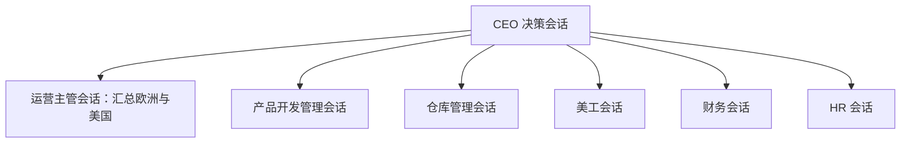

# 公司组织架构与角色会话映射

本文供 CEO 在分派和审阅公司决策时使用：先看现实公司有哪些人、已确认哪些管理关系，再找到六个数字职能各自唯一的角色手册和常驻会话。数字会话提供专业判断，不等于新增员工、现实岗位任命或经营审批权。本文件是会话与角色的主映射；人员编制和扩张状态以 [CEO 决策画像](CEO决策画像.md) 中后续核实的资料更新。

## 一、现实公司的人数与已知管理关系

CEO 最新说明公司共 31 人，以下人数合计为 31。已知欧洲和美国各有一位现实运营主管，仓库有两名管理员；两位主管是否计入运营 18 人，尚未核对。各岗位的正式汇报线尚未完整核实，不能因数字角色向 CEO 汇报，就认定现实员工也都由 CEO 直管。

| 现实人员或职能 | 人数 | 已知情况 |
| --- | ---: | --- |
| CEO | 1 | 制定方向、综合主管与职能意见并最终决策 |
| 运营销售 | 18 | 覆盖欧洲和美国业务；欧洲、美国各有一位主管，主管是否包含在 18 人内待核 |
| 仓库、后勤、发货 | 6 | 其中 2 名仓库管理员；负责南宁仓与发货相关工作 |
| 财务 | 2 | 两人的具体分工及汇报关系待核 |
| 美工 | 1 | 单人配置，实际需求和产能待测 |
| 产品开发 | 1 | CEO 已确认新品输出不足是扩张约束 |
| 数据收集整理 | 1 | 为经营、运营及财务分析提供数据；具体汇报关系待核 |
| HR | 1 | 负责招聘、人事等工作；具体审批权限待核 |

公司存在采购职能，但采购人员归属、是否由上述岗位兼任及审批权限尚未明确，不额外虚增人数或设立“采购负责人”数字会话。

### 现实运营线：现状与计划分开看

**当前已知：**欧洲业务和美国业务各有一位现实运营主管。现有 18 名运营的站点、店铺、组长、组员和两位主管的人头分布尚未完整录入。

**拟议的管理层级：**CEO → 欧洲／美国主管 → 小组长 → 运营组员。这是 CEO 希望建立的垂直管理结构，不能写成已经全面落地。欧洲拟新增的三人小组由组长负责德国站、一名组员负责英国站、另一名组员负责法国与西班牙站；意大利站归属待定。拟提拔的组长仍经营一个原站点、监管原店，并带领新组，其时间和交接能力须单独验证。

## 二、数字决策团队：一个角色对应一份手册和一个常驻会话

CEO 会话负责下达公司级问题、收集六个职能意见并形成综合判断。六个角色的常驻会话保存各自的判断、后续追问和修订；讨论下一项决策时沿用原会话。数字运营主管是**唯一的运营汇报会话**：汇总现实欧洲与美国两条业务线后向 CEO 汇报，不另设“运营员工 A／B”数字角色。

| 数字角色 | 唯一常驻会话 | 对应的职责文件 | 对应现实职能及向 CEO 提交的判断 |
| --- | --- | --- | --- |
| CEO | [CEO 决策画像](codex://threads/01a0fb6d-4d44-7732-8ebc-e378c6bf4ae2) | [CEO 决策画像](CEO决策画像.md) | 对照本人经验、利润底线和授权规则，整合六方建议并拍板 |
| 运营主管 | [运营主管｜WZD](codex://threads/01a0fb6e-5333-7421-a6fb-692099601d5d) | [运营](roles/运营.md) | 现实欧洲与美国运营主管及其团队；汇总两线销售、店铺、广告、毛利和账号风险 |
| 产品开发管理 | [产品开发管理｜WZD](codex://threads/01a0fd56-92ad-7521-9301-6dcafe4161cf) | [产品开发管理](roles/产品开发管理.md) | 现实产品开发岗位；判断需求、产品规格、供应商与上市关口 |
| 仓库管理 | [仓库管理｜WZD](codex://threads/01a0fd56-74ab-7992-8b59-1a174aad20bb) | [仓库管理](roles/仓库管理.md) | 现实仓库、后勤、发货团队；判断库存、处理能力、补货和 FBA 可售日期 |
| 美工 | [美工｜WZD](codex://threads/01a0fd56-a978-75f3-b44a-59a903f9c2df) | [美工](roles/美工.md) | 现实美工岗位；判断页面与包装素材、证据、本地化和制作排期 |
| 财务 | [财务｜WZD](codex://threads/01a0fd47-2df4-7331-ab77-b2576b2e223d) | [财务](roles/财务.md) | 现实财务团队；判断利润口径、现金、预算及资金风险 |
| HR | [HR｜WZD](codex://threads/01a0fd47-5b7f-7652-ade3-a71ce07d8b74) | [HR](roles/HR.md) | 现实 HR 岗位；判断组织、招聘、培养、绩效和留任 |

[财务与 HR](roles/财务与HR.md) 仅是过去合并角色留下的索引，分别指向现行财务和 HR 手册，不是第七个数字角色。现实数据岗与采购职能仍应参与提供事实和执行支持，目前没有独立数字会话。六个会话的意见也不表示现实部门员工已经审阅或批准。

以下历史会话已经归档，不在当前汇报链：

| 历史会话 | 当前对应关系 |
| --- | --- |
| [运营员工 A](codex://threads/01a0fb74-d457-7d53-aa2d-de35531aeed0)、[运营员工 B](codex://threads/01a0fb74-ed2a-7003-a6e7-72acd6196627) | 运营判断统一进入现行的运营主管会话；不再分设数字组员 |
| [财务与 HR](codex://threads/01a0fb6e-61d0-7940-99a3-be9840251e37) | 已拆分为财务和 HR 两个独立常驻会话 |
| [评估领星 ERP 数据接入可行性](codex://threads/01a0fd62-ab7f-7ef3-a1e0-72407b750440) | 已完成的专题讨论，不是组织角色；其结论可由相关常驻角色继续复核 |

项目中如果以后出现其他专题会话，它们用于完成具体项目，不因此成为新的组织角色；其结论应交给相关常驻角色复核，再由 CEO 汇总。

## 三、公司级决策如何在会话之间流转

1. **CEO 定义问题。**写明目标、适用站点或店铺、产品范围、时间、利润要求及希望比较的方案；暂缺数据可以标记待补。
2. **六个常驻角色分别判断。**公司级战略或跨部门决策默认让运营、产品、仓库、美工、财务、HR 六方参与；各自提出依据、风险、所需资源、可执行任务、停止条件和须 CEO 决定的事项。
3. **角色之间核对依赖。**运营的销量须对上产品交付、素材上线、FBA 可售量、人员达产和预算；各角色指出其他方案的缺口并修订自己的承诺。现实数据岗、采购及区域主管提供原始资料与执行约束。
4. **CEO 汇总并拍板。**统一去重销售和投入，记录分歧、前提及责任人，再决定推进、试点、调整或暂停。数字角色的建议不能自动触发招聘、采购、投放、账户操作或对外承诺。
5. **回到原会话跟踪。**后续数据、执行偏差和复盘继续写入同一职能会话；公司级结论更新到相应规划文档，避免每次新建临时角色。

账号安全、Listing 侵权或其他重大合规异常依照 CEO 已明确的规则迅速直接报告 CEO，不等待常规汇总。

## 四、待核实的组织信息

- 欧洲、美国两位现实主管是否包含在运营 18 人内；各店、站点现有组长及组员如何分配。
- 现实美工、开发、财务、HR、数据岗及两位仓库管理员的正式汇报对象和审批权限。
- 采购职能由谁负责、编制归属、下单及供应商承诺的审批人。
- 拟议三人小组是否已成立；组长保留的老站点、原站接手人、新组德国站与意大利站分别由谁负责。

这些缺口未核实前，本文件只描述已知人员和拟议组织关系，不替公司宣布任命或编制变动。
