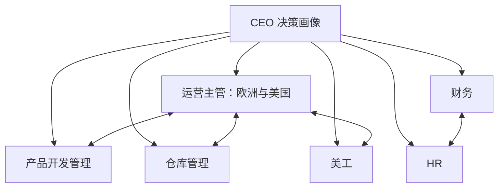

# WZD 本地对话关系

源码已下载，来源版本：`8db5b894bdf4423eb7e818f6d8c65a053945e2a8`。最初采用 GitHub 源码压缩包下载；2026-10-03 已补齐 Git 克隆元数据、远程配置与版本历史，并核对全部跟踪文件。

## 创建状态

2026-10-03 已成功创建七个常驻对话，全部归入 WZD 亚马逊公司管理项目。README、组织映射及岗位手册的现行链接已同步更新。关系通过角色说明和共享映射建立，不代表应用原生上下级权限或自动消息同步。

- [CEO 决策画像](codex://threads/01a0fd75-a631-75d3-b688-b17496f5e5a3)
- [运营主管｜WZD](codex://threads/01a0fd75-f111-7a81-be87-ce944ffb4d97)
- [产品开发管理｜WZD](codex://threads/01a0fd75-f205-71a3-a546-3824aa740882)
- [仓库管理｜WZD](codex://threads/01a0fd75-f300-7631-b163-da6684b130d8)
- [美工｜WZD](codex://threads/01a0fd75-f408-7d01-8b7d-6067c3c5937f)
- [财务｜WZD](codex://threads/01a0fd75-f519-77b3-83ca-d773b52adfa8)
- [HR｜WZD](codex://threads/01a0fd75-f618-7fc3-851e-6ea2b6025eb1)

## 数字团队汇报关系

CEO负责定义问题、分派任务、整合分歧并提交用户最终决策。六个职能独立评估并向CEO汇报；运营主管统一汇总欧洲和美国业务。产品与运营、美工核对卖点和上市准备；仓库与运营核对库存和可售日期；财务与各职能核对预算、利润和现金；HR与运营、财务核对编制、培养及激励。完整接口见各角色手册与会话关系.json。

现实公司共31人的描述来自原仓库；主管人数归属、部分正式汇报线及采购归属尚待核实。现实拟议层级为CEO→欧洲/美国主管→小组长→运营组员，不能当作已经落地。数字对话不代表现实任命或经营审批权。

## 初始化文件

- CEO：ceo-对话初始化.md
- 运营主管：ops-对话初始化.md
- 产品开发管理：product-对话初始化.md
- 仓库管理：warehouse-对话初始化.md
- 美工：design-对话初始化.md
- 财务：finance-对话初始化.md
- HR：hr-对话初始化.md

共享文件是可查阅的上下文，对话间信息流转仍需明确任务触发，不代表已启用自动同步或常驻调度。
